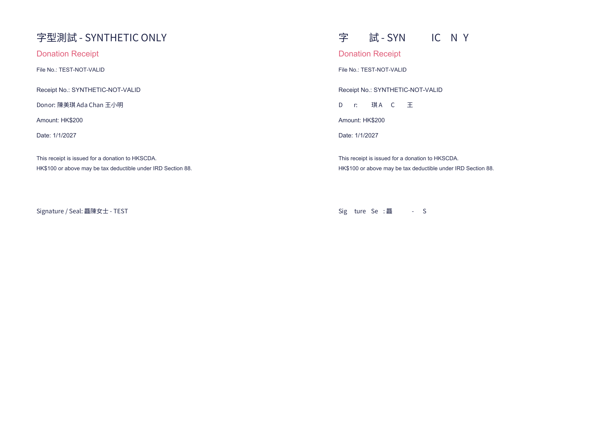
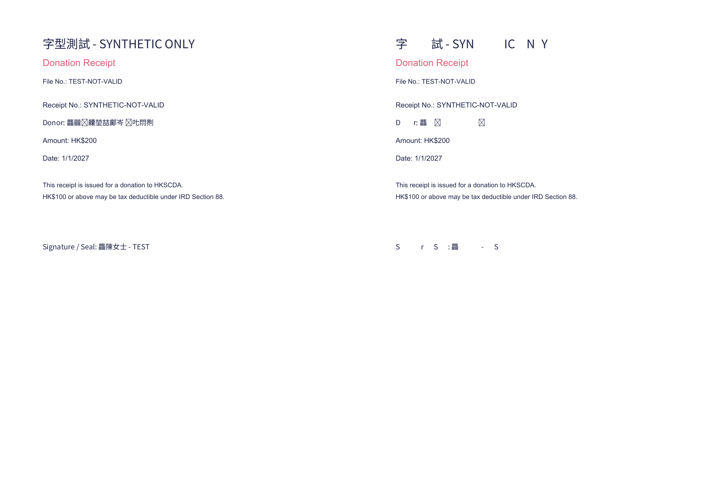
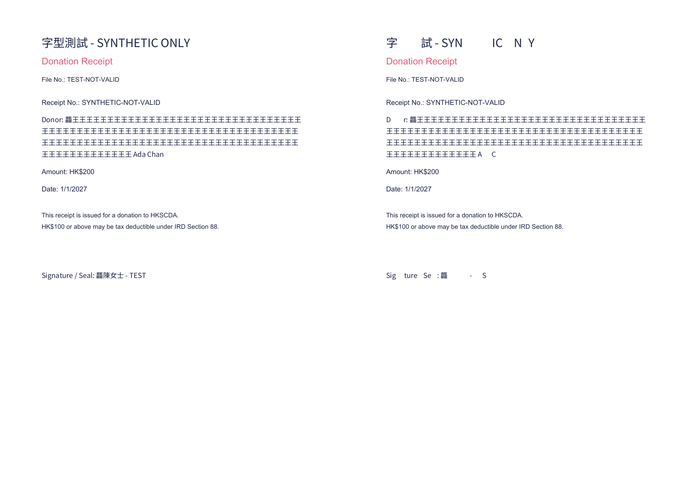
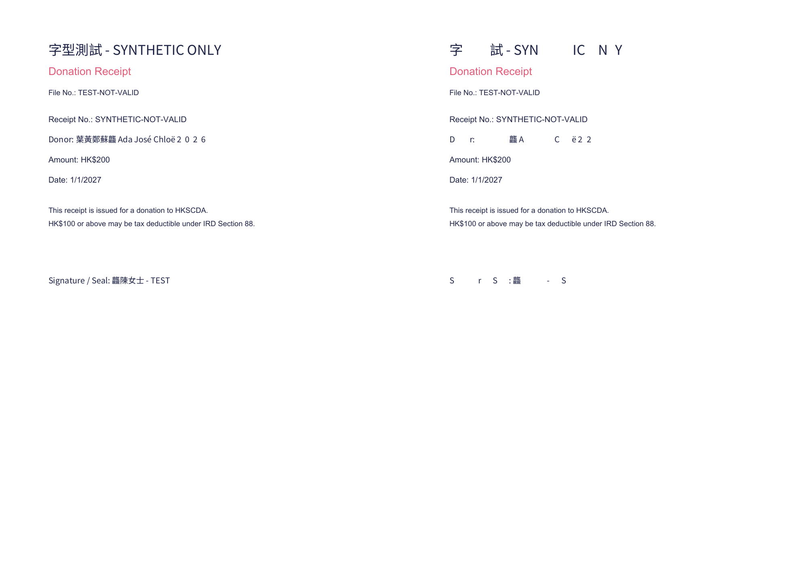

# T06 / R11 actual font acceptance · 2026-10-06

**Decision: reject the subset candidate. R11 remains partial.** Existing receipt date handling, single-flight font byte cache and full-font embedding remain in place. This follow-up changes evidence, diagnostic scripts and the R11 tracker row only. It does not issue receipts, replace the font, enable payments, send notifications or apply schema.

## Source and environment

- Tested source: `051ab5034b4ed416494b3814f51c8d2f03a67ff5` (#198). Receipt implementation and font are identical to main `4bbd4a4dffbd053328e92c03281a23d1d4ebe682`; per-file hashes are in [receipt.json](r11-font/receipt.json).
- Same Windows host, Bun, input cases and bundled `NotoSansHK-Regular.ttf` for both modes. Font size: 7,071,436 bytes; SHA-256 `64e61735caad749acbea2f3a4700b3f25c97dc44c15e5bf860ef61ed6bc20126`.
- OS-only environment allowlist; no `.env` loading or provider/DB credentials. Synthetic charity/file number/signatory and receipt number `SYNTHETIC-NOT-VALID`. Fetch is entirely intercepted with local font bytes. One intercepted load per mode, zero network downloads.
- Full mode calls the unchanged application generator. The diagnostic subset mode intercepts `PDFDocument.embedFont` only for custom fonts to force `subset:true`, then restores the method and fetch in `finally`. This candidate was never installed in application source.

## Native commands and outcomes

From the tested worktree, with the existing scratch directory abbreviated as `D=.superpowers/sdd/r01-forward-schema-plan-20261001/r11-font-diagnostic-20261006`:

```powershell
$D='.superpowers/sdd/r01-forward-schema-plan-20261001/r11-font-diagnostic-20261006'
$env:APP_URL='http://127.0.0.1:59999'
$env:RECEIPT_CHARITY_NAME='字型測試 - SYNTHETIC ONLY'
$env:RECEIPT_FILE_NO='TEST-NOT-VALID'
$env:RECEIPT_SIGNATORY_NAME='龘陳女士 - TEST'
& 'C:/Users/laich/.bun/bin/bun.exe' --no-env-file "$D/compare.ts" full "$D/output"
& 'C:/Users/laich/.bun/bin/bun.exe' --no-env-file "$D/compare.ts" subset "$D/output"
& 'C:/Users/laich/.cache/codex-runtimes/codex-primary-runtime/dependencies/python/python.exe' "$D/inspect_receipts.py"
```

Exact executed argv, timestamps, PIDs, exits and hashes are preserved in `receipt.json`. Reproduction sources are [compare.ts](r11-font/compare.ts) and [inspect_receipts.py](r11-font/inspect_receipts.py); copying these to `D` retains the tested relative application import and output directory. Use the stated synthetic environment and intercepted fetch, not provider credentials.

| Operation | Native result |
|---|---|
| PDF artifact marker | exit 0; expected eight synthetic PDFs |
| Initial full / subset generators, 08:06 UTC | PID47704 / exit0; PID49832 / exit0; retained in initialDiagnostic |
| Strict diagnostic TypeScript, first / corrected | PID11972 / exit2 (fetch stub missing Bun preconnect); PID52572 / exit0 after adding a no-op preconnect; no application changes |
| Typed full generator, 08:17:55 UTC | PID17396 / exit0; four one-page PDFs; intercepted fetch1 |
| Typed subset candidate, 08:18:04 UTC | PID53236 / exit0; four one-page PDFs; intercepted fetch1 |
| First inspector attempt | exit1 before rendering: scratch `inspect.py` shadowed Python standard-library `inspect`; retained as an environment/script failure |
| Renamed `inspect_receipts.py` | exit0; all eight Poppler children exit0; pypdf text extraction and PNG comparison completed |
| Existing receipt regression tests | PID1504 / exit0; 6 pass, 0 fail, 19 assertions, two files |
| Repository `tsc --noEmit` | PID34300 / exit0; build success is not substituted for typecheck |

All render stderr is retained: Poppler reports unavailable `Symbol` / `ArialUnicode` display fonts in both modes. The inspector also emits a Pillow `getdata` deprecation warning. These are not presented as zero-warning runs. Full-font CJK text renders visibly; the subset candidate has missing glyphs despite successful renderer exits.

## Same-environment samples

These are one generation per case, with sequential warm-cache behavior, not a statistically repeated throughput benchmark. CPU is process user + system microseconds converted to milliseconds. No speed-improvement or production-latency claim is made.

| Case | Full bytes | Subset bytes | Elapsed ms full / subset | CPU ms full / subset | Differing rendered pixels |
|---|---:|---:|---:|---:|---:|
| Common Chinese / English | 4,338,692 | 6,784 | 1003.49 / 218.82 | 1157 / 281 | 4717 |
| Rare Han, including supplementary code points | 4,338,685 | 8,145 | 801.24 / 63.22 | 766 / 140 | 6059 |
| 120-character Chinese name with mixed suffix | 4,338,769 | 6,241 | 869.04 / 456.05 | 766 / 203 | 3892 |
| Chinese / accented Latin / digits | 4,338,710 | 7,648 | 899.80 / 144.82 | 734 / 63 | 5942 |

All PDFs are one A4 page. Every pair was rendered at 120 dpi (993×1404 per page) and visually inspected. The subset candidate loses ordinary Chinese and Latin glyphs in the title, donor and signatory fields in all four cases. Text extraction matches the full candidate in three cases, demonstrating why extraction alone cannot admit a font change.

## Before / candidate images

Each pair is **left: current full embedding; right: rejected subset candidate**. Inputs contain no real donor data.









## Additional gaps and release boundary

- The existing font reports no glyph for `靐` (U+9750) and `𠮷` (U+20BB7); the full-mode rare sample visibly contains missing-glyph boxes and extracted text omits both. `subset:false` does not prove complete rare-Han coverage.
- The full mixed-script PDF visibly renders `2026`, but pypdf extracts those donor digits as `低佌低佒`. The subset candidate extracts the digits correctly while losing visible glyphs elsewhere. This extraction defect is separately recorded; neither candidate satisfies all acceptance checks. Its precise library/font mapping cause is not established by this experiment.
- Earlier 100-PDF cache measurements remain historical. A new 100-PDF batch/recovery run, peak memory, alternate/approved font, hosted PDF readers, provider delivery and real receipts are **not-run** for this follow-up.
- R11 remains `code_complete=partial`, `operationally_enabled=partial` for the already-deployed byte cache only. The size and glyph work is open. No application rollback is needed because no application change was made.
- This evidence does not resolve #183's finance ACL failure, the exact Task1/Task8 source approval holds, R01's hosted/schema gates, or the fourteen unapproved forward production files. Conditional stack merge remains held.
