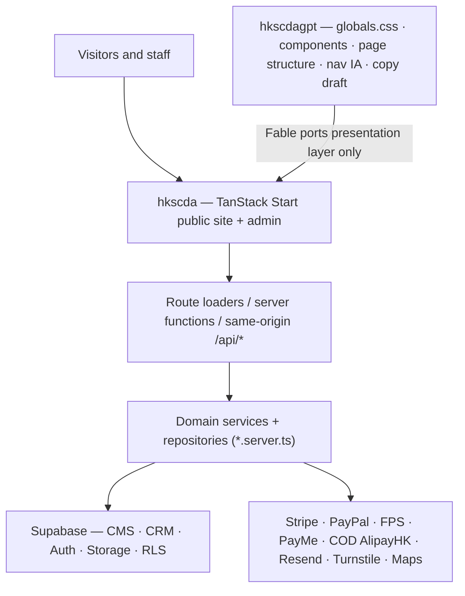

# HKSCDA Site · CMS · CRM · Backend Integration Plan — v4 (Fable execution edition)

**Project:** 香港拯救貓狗協會 HKSCDA · 領養代替購買
**Document date:** 2026-08-27 (v4 — supersedes v3 of the same date; v3's Chinese narrative remains the reference for the CMS/CRM/API principles it inherited from the 08-26 edition)
**Executor:** Claude Fable 5 running in Claude Code, supervised by the HKSCDA tech lead (reviews, approvals, merges). One engineer owns the BP-x backend packages. The content/operations owner decides the D-x items.
**Design source:** [YNWAforever/hkscdagpt](https://github.com/YNWAforever/hkscdagpt) `main@953ecba` → ported into [YNWAforever/hkscda](https://github.com/YNWAforever/hkscda) `main@8d717f5` (the only system of record).
**Related:** [PR #60 `feat/public-layout-v2@47d4d84`](https://github.com/YNWAforever/hkscda/pull/60) — harvested for non-visual fixes, closed for visuals.
**Status:** Executable. Nothing in production, the repositories, or the database was changed while preparing this document.
**Intended repo location:** `docs/superpowers/plans/2026-08-27-public-layout-integration-v4.md` (the repo's `AGENTS.md` convention for plans).

> **How v4 differs from v3.** v3 inventoried both repositories by reading files. v4 additionally *ran* them: both repositories were cloned, the four CI steps were executed locally on `main` and on PR #60, the brand verifier was run against production builds of both, the Vercel project was inspected read-only, and the live domains were fetched. Section 1 lists every v3 statement that had to be corrected as a result. Everything in v3 that Section 1 does not contradict was confirmed and is carried forward, usually condensed, with a pointer to the v3 section.

---

## 0. Operating rules for Fable

Read the repo's `AGENTS.md` (identical to `CLAUDE.md`) before any work in `hkscda`. Where `AGENTS.md` conflicts with this document, `AGENTS.md` wins and the PR description records the difference. The rules below are v3 §0 with the corrections from Section 1 applied.

### 0.1 Allowed

- Create feature branches in `hkscda` named per §10; commit per work package with Conventional Commits; each commit message says what was ported and which contract was preserved.
- Read all of `hkscdagpt` as the **design source**; port its presentation layer (`app/globals.css` design system, `components/*`, page structures, copy structure) into `hkscda`.
- Modify `src/routes/**` public route files (component, `head`, `loader`), `src/components/site/**`, `src/styles.css` (plus new `src/styles/public.css`), `public/**`, `src/assets/**`, `docs/**`, `.github/workflows/ci.yml` (WP-0 only), `vercel.json` (branch deploy exclusions only).
- Add **read-only public projections** as TanStack server functions following the patterns PR #60 already proved: `src/lib/animals/publicListing.*` (anon client, RLS authoritative) and `src/lib/content/publicStory.functions.ts` (existing content service behind a server-only dynamic import, published-only enforced in `service.getPublicContentBySlug`). Never loosen RLS to make a projection work.
- **Regenerate and commit `src/routeTree.gen.ts`** whenever a route file is added, renamed, or removed — it is tracked in git and CI typechecks before it builds (this is exactly why PR #60 is red; see C-1). Regenerate with `bun run build` or by starting `bun run dev`; never edit it by hand.
- Add `bun:test` tests beside every touched file (dependency-injected fakes, injectable clocks) and run every command in §9 before opening a PR.
- Open **draft** PRs with the §9 outputs, screenshots at 375/768/1440, and the route-parity rows the PR satisfies.

### 0.2 Forbidden (hard stops)

- Never treat `hkscdagpt` as a second deployable frontend. No Supabase keys, no deploy config. After the port it is archived.
- Never change any existing URL, route file name, query-param name (`page`, `filter`, `slug`, `token`), loader/action signature, `/api/*` request or response schema, status-token flow, or localStorage key. Adding a query param (only `gender` is planned, D-4) must be listed in the PR and approved.
- Never bring in `hkscdagpt`'s mock data (`lib/public-content/mock.ts`), review modes (`ENABLE_MOCK_DATA`, `CMS_READ_MODE`, `?state=`), or the 28 cross-origin `existingApp()` handoffs (`lib/site-links.ts`).
- Never modify `supabase/**`, RLS or Storage policies, `src/server.ts`, `src/routes/api/**`, payment providers or webhooks, auth, CRM state machines, or `src/lib/**` business logic unless the change is a listed BP-x task. UI work packages are **zero-migration**.
- Never import a service/secret key, a privileged Supabase client, or a `*.server.ts` module into browser code. Server functions may dynamically import `*.server.ts` inside their handler (the established pattern).
- Never deploy to production, change Vercel or Supabase project settings, rotate secrets, change domains/DNS, or open a public preview. **On this repo a merge to `main` is a production deploy** (Vercel auto-deploys `main` to the public `hkscda.vercel.app`). Fable therefore never merges: the tech lead merges, and every WP-0 PR must be safe to ship on its own.
- Never port `hkscdagpt`'s hosting scaffolding (`worker/`, `build/`, `scripts/*.sh`, `.openai/`, `vite.config.ts`, `next.config.ts`, `db/`, `drizzle*`, `examples/`, `app/chatgpt-auth.ts`, `app/robots.ts` — the last one disallows the whole site).
- Never mark a work package done while typecheck, test, lint, build, or (from WP-1) brand verify is red.

### 0.3 Stop and ask the tech lead when

- A port needs a new column, API, RPC, or migration (e.g. adoption aggregate, team profiles, FAQ CMS) — file it as a BP-x issue and implement only the empty/"not yet published" state.
- `hkscdagpt` copy contradicts operational content already in `site_config`/CMS (fees, accounts, phone, address, hours).
- An existing test fails because the design changes behaviour rather than because the port is wrong.
- A CI failure's root cause is CI infrastructure rather than code (see C-2 for the known ones).
- A §12 decision (D-x) has no default, or the default would change what visitors see on the live site (D-2 in particular: removing the homepage bank details is a visible production change).

---

## 1. Verification results — what v4 corrects in v3

Every item was checked on 2026-08-27 against `hkscda@8d717f5`, `hkscda@origin/feat/public-layout-v2 (47d4d84)`, `hkscdagpt@953ecba`, the Vercel project, and the live domains. Evidence commands are in §13.

### 1.1 Confirmed as stated in v3

`main` is still `8d717f5` (no commits since 2026-08-16). PR #60 is 3 commits, 76 files, +2,127/−949, based on `8d717f5`, never deployed. `hkscda` has 27 public routes plus `__root`, 119 files under `src/routes/api`, 38 migrations (2026-06-11 → 2026-08-16), `AGENTS.md` identical to `CLAUDE.md`, and the `animals` read policy `using (status = 'available')` (no role clause, so it governs anon and every other role). `styles.css` `@theme` values match the v3 §5 table exactly. Defects G-01 through G-15 all reproduce (G-16 remains "reported, not reproduced"). `hkscdagpt` matches v3 §2.1 in every checked detail: 72 files; `app/globals.css` 5,235 lines with the section boundaries v3 cites (Header 297, Hero 694, Animal cards 823, Page hero 1258, Filters 1283, States 1483, Detail 1572, Route parity 1765, Footer 1865, Public-route system 2260, Candidate 3073, Instructions 3627, Stories hub 4406); 28 `existingApp()` call sites; `robots.ts` disallow-all; `layout.tsx` `noindex` with a chatgpt.site `metadataBase`; the five nav groups; the seven JPGs byte-identical to `hkscda/src/assets` (`hero-dog.jpg` = `dog-smiling.jpg`, logo = `public/brand/hkscda-logo-primary.jpg`); `og.png` at 1731×909.

### 1.2 Corrections (C-x) — these change the plan

| ID | v3 said | Verified reality | Effect on v4 |
|---|---|---|---|
| **C-1** | PR #60's CI red is most likely the preview server, `verify:brand`, or an `http://` Supabase URL (§2.4) | Running PR #60's own CI steps locally: **typecheck fails first** with 3 errors — `src/routes/robots[.]txt.ts(5)` and `sitemap[.]xml.ts(68)` (route ids absent from the committed `src/routeTree.gen.ts`, which PR #60 never regenerated) and `src/routes/sponsors.tsx(81)` (missing new `genderFilter` prop). Then `bun test --isolate` has 1 failure (`src/routes/donate.test.tsx` "renders the optional purpose note…": three `target="_blank"` links, test expects two) and `bun run lint` has 24 prettier errors. Build passes (and leaves `routeTree.gen.ts` modified). The brand-verify hypotheses were never reached. | WP-0a records this as the issue; the harvest branches fix each item; rule 0.1 on `routeTree.gen.ts` added. |
| **C-2** | Add `verify:brand` to CI with `VITE_SUPABASE_URL=https://example.supabase.co` so the Supabase client can be constructed (WP-0 task 4) | The client constructs fine with any URL. What actually happens: (a) with `example.supabase.co`, browser-side Supabase queries fail DNS/tunnel and the verifier records 44 `request failed` failures on `main`; (b) with **no reachable Supabase, four SSR routes return HTTP 500 on `main`** — `/stories`, `/report/audit`, `/adoption/instructions`, `/knowledge` — because their loaders throw (new **G-17**); (c) on PR #60 the new detail loaders throw a Zod `Invalid uuid` for non-UUID ids, so `/animals/cat/__brand-verification__` returns 500 instead of 404 (new **G-18**). The verifier itself ran fine locally: preview ready in 2 s, full run 7–9 min. | Brand verify in CI is re-sequenced: WP-0e (loader resilience) and WP-0f (PostgREST-shaped fixture server for CI) come first; the job is added non-blocking and made required once green. |
| **C-3** | `VITE_PUBLIC_DONATION_CHECKOUT_ENABLED` is an existing gate on `/donate` (§4.2, WP-5) | It does **not exist on `main`** (0 occurrences). PR #60 introduced it (`donate.tsx`, `.env.example`, `docs/donations-runbook.md`). | Harvested in WP-0d as part of P0-03. |
| **C-4** | Homepage bank/FPS/PayMe removal is WP-2 work | PR #60's `index.tsx` already removes `donateMethods`, "每月 HK$100" and "每年救助超過600隻"; `__root.tsx`'s default description still says "每年救助超過600隻毛孩" on `main`. | The content removal is harvested as its own small PR in WP-0d (visible production change → D-2 acknowledgement before merge). |
| **C-5** | Public projections must "only use the existing anon client" (§0.1) | Content tables are granted to `service_role` only (`20260705120000_story_promotion_center.sql`, no anon policy). `/api/stories/$slug` on `main` and PR #60's `publicStory.functions.ts` both use `createSupabaseServiceClient()` with the published-only filter in `service.getPublicContentBySlug`. | Rule 0.1 now distinguishes animals (anon, RLS) from content (existing service, server-only). |
| **C-6** | Harvest PR #60's dynamic `robots.txt`/`sitemap.xml` as-is (D-8 default: keep `/adoption/apply` disallowed) | PR #60's `robots[.]txt.ts` **drops** `Disallow: /adoption/apply` and its sitemap **adds** `/adoption/apply`. Worse, PR #60 left `public/robots.txt` and `public/sitemap.xml` in place; the Vercel output config routes `handle: filesystem` before `/__server`, so on Vercel the static files would shadow the dynamic routes entirely (new **G-21**). | WP-0b deletes the static files, restores the D-8 default, and adds a test that the sitemap never contains `/adoption/apply`, status, admin, or API paths. |
| **C-7** | Canonical domain is undecided between `hkscda.com` and `hkscda.vercel.app` (D-1) | The Vercel project `hkscda` (team `ynwaforevers-projects`, Hobby plan, framework `tanstack-start`, Node 24.x) serves **only** `hkscda.vercel.app` (+ auto aliases); no custom domain is attached; production = `8d717f5`, READY. Deployment protection is Vercel Authentication with `deploymentType: all_except_custom_domains` (password and trusted-IP protection off); the production domain `hkscda.vercel.app` is publicly readable — confirmed by fetching it anonymously; it currently shows the hardcoded PayMe/FPS/bank details. **`hkscda.com` is the association's legacy site, live and separate.** | D-1 stays with the owner, now with facts: canonical `hkscda.com` on `main` points at a domain this app does not serve; PR #60's flip to `vercel.app` would invite indexing of a domain the org presumably will not keep. v4 default: single constant defaulting to `https://hkscda.com`, one env var to switch (WP-0b). |
| **C-8** | Four `feat/sponsorship-*` branches are unmerged (P0-06, BP-4) | `feat/sponsorship-shortlist-ui` and `feat/sponsorship-pledge-submission` are **already in `main`** (0 commits ahead). `feat/sponsorship-pledge-admin-review` is the only real gap: 39 commits, 42 files, +10,250 lines (new `src/lib/sponsorshipAdmin/*`, admin API under `src/routes/api/admin/sponsorships/pledges/*`, `PledgeDetailDrawer`/`PledgeReviewLane`, 3 migrations), and it is 321 commits behind `main`. `feat/sponsorship-status-page` is that branch plus one commit. `main` has no admin sponsorship API or UI. | BP-4 scope rewritten: re-implement on current `main` from the branch's design/plan docs; do not rebase. |
| **C-9** | WP-2 uses `getPublicStoriesPage({ featuredOnly: true })`; `/report/audit` uses `loadReportAudit` | `getPublicStoriesPage` takes no arguments; featured stories are `item.storyProfile.isFeatured` on `loadPublicStoriesPage()` items (column `rescue_story_profile.is_featured`, not on `content_item`). `/report/audit` uses `loadPublishedAnnualReports` via `asContextFreeRouteLoader` (`src/lib/documents`). Shortlist limits are `ADOPTION_LIMIT` / `SPONSORSHIP_LIMIT` and the key is `SHORTLIST_STORAGE_KEY` in `src/lib/publicAdoption/shortlist.ts`; `MAX_ADOPTION_PREFERENCES = 3`, `MAX_ADOPTION_PHOTOS = 6`, `MAX_PHOTO_BYTES = 8 MiB`. | Symbol names fixed in WP-2/WP-4/WP-6. |
| **C-10** | G-04 (public page queries `adopted`, RLS returns nothing) is `/report/adoption` only | `src/routes/about/index.tsx:52-53` also counts adopted cats/dogs from the browser with the anon client. | BP-1's aggregate serves `/report/adoption`, `/about` and the homepage impact band; WP-6 gives `/about` the same "not yet published" state. |
| **C-11** | The CI brand verifier covers 22 routes × 5 viewports | `scripts/verify-public-brand.mjs` (already on `main`) covers 18 static + 4 discovered detail + 4 synthetic state routes = **26 × 5**, plus reflow and reduced-motion passes; it fails on any console error, failed request to a non-allowlisted host, asset 404, missing logo, ≠1 `h1`, horizontal overflow, missing focus ring, or token leakage on status routes. Repo pins `playwright ^1.60.0`. | Acceptance criteria and §9 recipe updated. |
| **C-12** | Existing copy guard test protects against unverified numbers | `src/lib/brand/publicCopyGuard.test.ts` scans all public source, but its two Chinese forbidden strings are mojibake (`"瘥僑?頞?600"`), so "每年救助超過600隻" in `__root.tsx` passes today (new **G-19**). | WP-0a repairs the guard with `\u` escapes and WP-0d/WP-2 extend it (payment details, placeholders, handoff tokens). |
| **C-13** | `APP_URL` is the single origin | Defaults differ per module: `http://localhost:5173` (content, volunteers, `/api/stories*`, `/api/admin/content/-handlers.ts`), `http://localhost:3000` (`donations/config.server.ts`), `https://hkscda.vercel.app` (PR #60). 70 hardcoded `hkscda.com`/`hkscda.vercel.app` strings exist in non-test source (new **G-20**). | WP-0b introduces `PUBLIC_SITE_ORIGIN`/`publicUrl()` for everything rendered into HTML; server `APP_URL` defaults are aligned in BP-5. |
| **C-14** | Plan file at `docs/HKSCDA_Site_CMS_CRM_Backend_Integration_Plan_2026-08-27.md`; ~1,090 tests | `AGENTS.md`: plans/specs land in `docs/superpowers/{plans,specs}/`. `bun test --isolate` on `main`: **1,253 pass, 0 fail, 206 files, 7 s**; typecheck 30 s; lint 0 errors/30 warnings 21 s; build 56 s. Local Bun 1.3.13 accepted the lockfile; CI pins 1.3.14. | Paths and numbers updated. |
| **C-15** | `hkscdagpt` has 11 presentational components | `components/` holds 10 (`adoption-instructions-page`, `animal-card`, `candidate-shortlist-page`, `filter-controls`, `public-page`, `review-notice`, `site-footer`, `site-header`, `state-panel`, `story-hub`); the two `error.tsx` files are route error boundaries. | Cosmetic. |

### 1.3 New defects found during verification

| # | Location | Problem | Owner |
|---|---|---|---|
| G-17 | `src/routes/{stories,knowledge,adoption/instructions,report/audit}.tsx` loaders | Throw when Supabase is unreachable → HTTP 500 for the whole page (no E! state). A production-outage behaviour, not just a CI problem. | WP-0e |
| G-18 | PR #60 `publicAnimal.functions.ts` / detail routes | Non-UUID `$id` → Zod throw → 500 instead of `notFound()`. | WP-0c (guard) + WP-3 (`notFound`) |
| G-19 | `src/lib/brand/publicCopyGuard.test.ts` | Forbidden Chinese strings are mojibake; the guard cannot catch "每年救助超過600隻". `__root.tsx` og description still carries that claim. | WP-0a / WP-0d |
| G-20 | `src/lib/**` `APP_URL` fallbacks; 70 hardcoded origins | Inconsistent origin defaults. | WP-0b (rendered HTML), BP-5 (server) |
| G-21 | PR #60 + `public/robots.txt`, `public/sitemap.xml` | Static files shadow the dynamic routes on Vercel; PR #60 also relaxes `/adoption/apply` against D-8. | WP-0b |
| G-22 | PR #60 `src/routes/sponsors.tsx`, `src/routes/donate.test.tsx`, prettier | Type error, failing test, 24 lint errors (C-1). | WP-0 harvest branches |

---

## 2. Verified baseline (condensed)

### 2.1 `hkscda@8d717f5` (system of record)

| Item | Verified |
|---|---|
| Stack | TanStack Start 1.167 / Router 1.168, React 19.2, Vite 7.3, Nitro (vercel preset), Tailwind 4.2, Radix/shadcn, Supabase JS 2.108, Bun 1.3.14 in CI, Playwright 1.60 |
| Public routes | 27 (`/`, animals ×4, adoption ×3, sponsors ×4, donate, volunteer ×3, stories ×2, knowledge, help, report ×2, about ×5) + `__root` |
| API | 119 files; public: adoption, donations, sponsorships (`pledges`, `status/$token`), stories (+map, +$slug), volunteer, webhooks (stripe/paypal/cod), csp-report; the rest under `/api/admin/**` |
| Tests | 1,253 across 206 files, all green on `main` |
| CI (`.github/workflows/ci.yml`) | checkout → setup-bun 1.3.14 → `bun install --frozen-lockfile` → typecheck → `bun test --isolate` → lint → build (`VITE_SUPABASE_URL=https://example.supabase.co`), 10-minute timeout, no brand verify, no branch protection visible |
| SEO | Static `public/robots.txt` (`Disallow: /admin/`, `/adoption/apply`) and `public/sitemap.xml` (16 URLs on `hkscda.com`, missing `/stories`, `/help`, details); canonical/OG hardcoded `https://hkscda.com/*`; fonts from Google Fonts in `__root.tsx:102-106`; CSP is **report-only** (`src/lib/security-headers.ts`) |
| Tokens | `styles.css` `@theme` already `#05648e`/`#a61c56` with `.site-shell`/`.admin-shell` scopes; `AGENTS.md` brand section and `brand/design-tokens.*` still describe the Poofyco/rose palette (stale) |
| Brand constants | `src/lib/brand/brand.ts` (`brand.nameZh/nameEn/acronym/slogan/logo/colors`) — no charity file no., AFCD no., phone, or founding date yet (those are hardcoded in `index.tsx`, `Footer.tsx`, `about/*`) |
| Env contract | `.env.example` names: `VITE_SUPABASE_URL`, `VITE_SUPABASE_ANON_KEY`, `SUPABASE_URL`, `SUPABASE_SERVICE_ROLE_KEY`, `SUPABASE_RECEIPT_BUCKET`, `APP_URL`, Stripe/PayPal/COD/Resend/receipt vars, `UPSTASH_*`, `TURNSTILE_SECRET_KEY`, `VITE_TURNSTILE_SITE_KEY`, `VITE_GOOGLE_MAPS_API_KEY`; Turnstile and Upstash fail open when unset; `src/lib/environmentContract.test.ts` asserts the documented set |
| Deployment | Vercel project `hkscda` (Hobby); `main` auto-deploys to production at `hkscda.vercel.app` (public); latest production deployment = `8d717f5` |

### 2.2 PR #60 `feat/public-layout-v2@47d4d84`

The v3 §2.4 harvest list is confirmed, with two additions (`VITE_PUBLIC_DONATION_CHECKOUT_ENABLED` gate; homepage content removals) and three hazards (stale `routeTree.gen.ts`, static robots/sitemap shadowing, `/adoption/apply` indexing). The visual layer (`.public-*` CSS +292 lines; `Header`/`Footer`/`PublicPageHero`/`AnimalGrid`/`AnimalCard`/`AnimalDetail`/`index.tsx` layout changes) is superseded by `hkscdagpt` and is not harvested.

### 2.3 `hkscdagpt@953ecba` (design source)

Exactly as v3 §2.1. Port only: `app/globals.css`, `components/*` (minus `review-notice.tsx`), `app/page.tsx`, `app/animals/**/page.tsx`, `app/[...slug]/page.tsx` structure, `app/layout.tsx` skeleton, `app/not-found.tsx`, `loading.tsx`/`error.tsx` copy, `lib/public-pages.ts` as copy draft, `lib/site-links.ts` `navGroups` only, `public/og.png` (D-6). Everything else is `drop` (v3 §4.3).

### 2.4 Still unverifiable from here

Live Supabase project `iihqjzilgawhfdhdevam` (schema drift, RLS grants, buckets, Auth redirects), Vercel env values, Resend/Stripe/PayPal/COD dashboards. The engineer connects a controlled staging and runs the read-only drift audit before any BP-x work (v3 §2.5 stands).

---

## 3. Target architecture and boundaries

Unchanged from v3 §3: one public origin, one TanStack runtime, one Supabase, one CMS/CRM, one payment configuration, one protected admin. `hkscdagpt` is a frozen design reference that never touches a database, form, payment, or PII.



Data-access rule for public projections (replaces v3 §0.1's anon-only wording): **animals** → anon client, RLS `status = 'available'` authoritative (`publicListing.server.ts`, `publicAnimal.functions.ts`); **content/stories/knowledge/documents** → the existing `*.server.ts` services behind server-only dynamic imports, with published-only filtering in the service layer (same as `/api/stories/$slug`, `publicStoriesPage.server.ts`, `documents/public.server.ts`). No new grants, no new policies in UI packages.

---

## 4. Migration map (`hkscdagpt` → `hkscda`)

Methods: `copy-as-is` (pure CSS/presentational), `rewrite` (router/data/i18n API changes), `merge` (combine with an existing component), `drop`. Line numbers refer to `app/globals.css` and were re-verified.

### 4.1 Design system and shell

| Source | Target | Method | Notes |
|---|---|---|---|
| `globals.css` L1–L296 (tokens, reset, `.container`, `.section`, `.eyebrow`, headings, `.button*`, `.text-link`, `.skip-link`, `.sr-only`) | `src/styles.css` `@theme` + new `src/styles/public.css` scoped under `.site-shell` | `rewrite` | Variable renames per §5; `.container` → `.public-container` (Tailwind v4 has a `container` utility); drop `.sr-only` (Tailwind provides it) |
| L297–L693 header/drawer CSS | `src/styles/public.css` | `copy-as-is` | |
| `components/site-header.tsx` | `src/components/site/Header.tsx` | `rewrite` | `next/link` → `Link`; `usePathname` → `useRouterState`; keep drawer a11y (Escape, focus trap, `inert`, scroll lock, viewport switch); nav data from new `src/components/site/navigation.ts`; `existingApp("/donate")` → `<Link to="/donate">`; keep `Header.test.tsx` green and add drawer tests |
| `components/site-footer.tsx` + L1865–L2259 | `src/components/site/Footer.tsx` | `merge` | Keep social links and `BrandLogo`; charity file no./AFCD no./email come from `src/lib/brand/brand.ts` (single source shared with the homepage trust panel) |
| `lib/site-links.ts` `navGroups` | `src/components/site/navigation.ts` | `rewrite` | Five groups only; drop `existingApp`, `EXISTING_APP_ORIGIN`, `HKSCDA_BACKEND_ORIGIN` |
| `app/layout.tsx` | `src/routes/__root.tsx` | `merge` | Take `<html lang="zh-Hant">`, skip-link position, `data-*` landmarks; keep the existing `head()` (origin from `publicUrl()`); Organization JSON-LD already exists in `src/lib/schema.tsx` |
| L1483–L1571 states/skeletons | `src/styles/public.css` | `copy-as-is` | Used by `PublicStateShell` and route `pendingComponent`s |
| `components/state-panel.tsx` | `src/components/site/PublicStateShell.tsx` | `merge` | Keep `role`/`action` props; apply `.state-panel` |
| `components/review-notice.tsx` + L788–L822 | — | `drop` | Review-mode only |
| `app/**/error.tsx`, `app/not-found.tsx`, `app/**/loading.tsx` | `__root.tsx` `ErrorComponent`/`NotFoundComponent`; route `errorComponent`/`pendingComponent` | `merge`/`rewrite` | Copy and `.error-page` layout |
| `public/images/*.jpg` (7), `hkscda-logo.jpg` | already in `src/assets/*.jpg`, `public/brand/hkscda-logo-primary.jpg` | `drop` | Byte-identical |
| `public/og.png` | `public/brand/og-default.png` | `copy-as-is` | Only after D-6 approval |
| `public/{favicon,file,globe,window}.svg`, L1765–L1864 route-parity CSS | — | `drop` | |

### 4.2 Pages

| Source | Target route(s) | Method | Data (hkscda) | Notes |
|---|---|---|---|---|
| `app/page.tsx` + L694–L1257 | `src/routes/index.tsx` split into `src/components/site/home/{HomeHero,FeaturedAnimals,ImpactBand,AdoptionStepsBand,FeaturedStory,HelpCards,TransparencyBand}.tsx` | `rewrite` | featured animals: `getPublicAnimalListing`; impact: `buildPublicImpact` fed by BP-1 (until then a "not yet published" state, never 0); featured story: `loadPublicStoriesPage()` filtered on `storyProfile.isFeatured` | Remove `donateMethods` (G-07, already gone after WP-0d), "每月 HK$100", testimonials in `SocialProof`/`SocialWall`/`VolunteerCarousel`, "每年救助超過600隻"; trust panel reads `src/lib/brand` constants |
| `app/animals/[species]/page.tsx` + `filter-controls.tsx` + `animal-card.tsx` + L823–L1005, L1283–L1482 | `src/routes/animals/{cat,dog}.tsx`, `src/components/site/{AnimalGrid,AnimalCard,AnimalFilterControls}.tsx` | `rewrite` | `getPublicAnimalListing` as route `loader` with `loaderDeps` (SSR) | `page`/`filter` unchanged; add `gender` (D-4, PR #60 naming); drop `?state=`; `candidate-link` → `ShortlistActionButton` |
| `app/animals/[species]/[id]/page.tsx` + L1572–L1764 | `src/routes/animals/{cat,dog}_.$id.tsx`, `src/components/site/AnimalDetail.tsx` | `rewrite` | `getPublicAnimal` loader; `head()` from loader data; non-UUID or non-available → `notFound()` (G-18) | Keep `ShortlistActionButton`/`ShortlistProvider`; "similar" via listing fn `pageSize: 4` excluding self |
| `components/adoption-instructions-page.tsx` + L3627–L4405 | `src/routes/adoption/instructions.tsx` | `rewrite` | existing `loadAdoptionInstructions` (`feesBySpecies`, `estates`, `guideGroups`) | Drop `hkscdagpt`'s hardcoded fees/rules/care; rules and care topics stay on `hkscda`'s current constants tagged `TODO(BP-3)` |
| `components/candidate-shortlist-page.tsx` + L3073–L3626 | `src/routes/adoption/apply.tsx` + `src/components/site/adoption/ApplicationWizard*` | `merge` | existing wizard, draft keys, Turnstile, `POST /api/adoption/applications` | Port only the page header (limit from `ADOPTION_LIMIT`), seven-step journey card, preparation grid, ready section as the frame; wizard internals untouched; drop cross-origin copy |
| `components/story-hub.tsx` + L4406–L5235 | `src/routes/stories.tsx` + `src/components/site/stories/*` | `rewrite` | `getPublicStoriesPage`, `/api/stories/map` | Drop the SVG map (keep the Google Maps district map and its privacy rules); drop `story-demo-notice` |
| `app/[...slug]/page.tsx` `StoryDetail` + article CSS | `src/routes/stories/$slug.tsx`, `src/components/site/stories/StoryDetail.tsx` | `rewrite` | `getPublicStory` loader (WP-0c) with `notFound()` and `head()` | Drop `article-demo-note` and `existingApp("/stories")` |
| `components/public-page.tsx` + `lib/public-pages.ts` + L2260–L3072 | new `src/components/site/PublicPageFrame.tsx` (hero, highlights, chapters, context panel, next-step; optional `CtaBand`) | `rewrite` | per-route loaders | Frame for 15 content routes; `lib/public-pages.ts` entries are the **copy starting point** with every "cross-domain / Sites cannot handle / secure handoff" phrase dropped |
| `/sponsors`, `/sponsors/pledge` | `src/routes/sponsors.tsx`, `sponsors_.pledge.tsx` | `merge` | existing sponsor query (`type = 'sponsor'`), `PledgeWizard`, `POST /api/sponsorships/pledges` | `sponsors_.$id.tsx` uses the animal-detail layout |
| `/donate` | `src/routes/donate.tsx` | `merge` | `loadDonationDocumentSlots`, provider config, `VITE_PUBLIC_DONATION_CHECKOUT_ENABLED` (WP-0d) | Method list from BP-2 `payment_public_config`; until then no account details are rendered |
| `/volunteer`, `/volunteer/group` + `VolunteerOpportunities` | `src/routes/volunteer.tsx`, `volunteer/group.tsx` | `merge` | `GET /api/volunteer/activities`, registration/group POSTs | Fix G-08 (`#volunteer-apply` → real form `id`) |
| `/knowledge`, `/help` | `src/routes/knowledge.tsx`, `help.tsx` | `merge` | `getPublicKnowledgePage`, `src/lib/help/faq.ts` + `HelpSearch` | |
| `/report/adoption`, `/report/audit` | `src/routes/report/{adoption,audit}.tsx` | `merge` | audit: `loadPublishedAnnualReports`; adoption: BP-1 | adoption shows "not yet published" until BP-1 |
| `/about`, `/about/{cccp,tnr,team,privacy}` | `src/routes/about/*.tsx` | `merge` | static copy; impact counts → BP-1; team → BP-3 | privacy keeps its legal text |
| `app/[...slug]/page.tsx` `generateMetadata` | each route's `head()` | `rewrite` | | title, description, canonical via `publicUrl()`, OG only with a real https image, `article` type for stories |
| `app/sitemap.ts`, `app/robots.ts`, `app/route-parity/*`, `lib/route-parity.ts`, `ROUTE_PARITY.md`, `CODEX_STAGE_B_HANDOFF.md` | — | `drop` | | Replaced by WP-0b routes and `docs/public-route-parity.md` |

### 4.3 Nav IA (D-5)

Default is `hkscdagpt`'s five groups (領養 / 支持救援 / 我們的工作 / 故事與資源 / 關於協會 + 首頁 + 「立即捐助」 CTA) — verified in `lib/site-links.ts`. Both IAs cover all 27 routes; only grouping changes, never URLs.

---

## 5. Design tokens

The v3 §5 table is verified against `styles.css` and stands. Edits to `@theme`: `--color-primary-hover` → `#034a69`; `--color-primary-highlight` → `#e4f2f7`; `--color-secondary-hover` → `#821442`; `--color-secondary-highlight` → `#f9e7ef`; `--color-text` → `#162c36`; `--color-text-muted` → `#5b6e76`; `--color-bg` → `#fffdf9` (D-7); `--color-surface-offset` → `#f6f1e9`; `--color-surface-offset-2` → `#e8ded0`; `--color-border` and `--color-divider` → `#d7ddd9`; `--color-success` → `#176f54` (+ highlight `#e2f4ed`); shadows → `rgba(15,51,65,.08)` / `rgba(8,52,70,.14)`; `--radius-panel` → `1rem`; add `--radius-pill: 999px`; every hardcoded hex in the ported CSS (`#a8deef`, `#b9e8f6`, `#edf2f1`, `#d7b2c2`, …) becomes a named token. Font stack becomes `"Noto Sans HK", "PingFang HK", "Microsoft JhengHei", system-ui, sans-serif`, self-hosted 400/700/900 (OFL). `.admin-shell` tokens do not change. WP-1 verifies `--color-text-muted` on `--color-bg` ≥ 4.5:1 with the existing `src/lib/brand/contrast.test.ts` pattern.

---

## 6. Blockers before any merge or launch (P0)

v3 §8 stands, with these amendments:

| ID | Amendment |
|---|---|
| P0-02 | Root cause known (C-1). Exit: the harvest PRs green on the *existing* four-step CI; brand verify added as a separate job and made required only after WP-0e/WP-0f make it pass. |
| P0-03 | Split: (a) homepage removal + checkout gate = WP-0d, ships as soon as D-2's "show nothing" default is acknowledged; (b) approved method list = BP-2. |
| P0-05 | Also covers `/about` counts (C-10). |
| P0-06 | Scope is one branch to re-implement (C-8). |
| P0-09 | Unchanged; the analytics helper is `redactSensitivePagePath` from PR #60 `src/lib/analytics.ts`. |
| P0-14 | Parity evidence uses `docs/public-route-parity.md` from PR #60 (already audited against `8d717f5`). |
| **P0-16 (new)** | SSR resilience (G-17): no public route may return 500 when a data source is unavailable; each renders its E! state with the shell, logo, one `h1`, and a retry action. Acceptance: `verify:brand` passes against a build with no reachable Supabase (fixture off) and with the fixture on. |
| **P0-17 (new)** | `routeTree.gen.ts` parity: CI typecheck must pass on the committed tree; add a CI step that fails if `bun run build` leaves `src/routeTree.gen.ts` modified (`git diff --exit-code -- src/routeTree.gen.ts`). |

Order: WP-0a → WP-0b/0c/0d (parallel, independent PRs) → WP-0e → WP-0f → engineer's staging/drift audit and branch protection (P0-12) → WP-1 → WP-2..WP-6 in parallel with BP-1/BP-2/BP-5 → WP-7 with BP-3/BP-4 → release gate.

---

## 7. Work packages — UI (Fable)

Each package: its own branch and draft PR, §9 fully green, parity evidence attached, `zero-migration` label. WP-0 is split into six small PRs on purpose: each becomes a production deploy the moment the tech lead merges it.

### WP-0a — CI evidence, guard repair, PR #60 disposition

**Branch:** `chore/layout-wp0a-ci-evidence`

1. Reproduce and file. Fetch `origin/feat/public-layout-v2`, run its six CI steps locally, and open the issue "PR #60 CI: typecheck (stale routeTree.gen.ts, sponsors.tsx genderFilter), donate.test.tsx, prettier" with the outputs attached (re-run §13's commands rather than pasting from this document).
2. Repair the copy guard (G-19): in `src/lib/brand/publicCopyGuard.test.ts` replace the mojibake literals with `\u`-escaped strings for "每年救助超過600" and "每月 HK$100", and add `G-XXXXXXXXXX`, `existingApp(`, `EXISTING_APP_ORIGIN`, `HKSCDA_BACKEND_ORIGIN`, `ENABLE_MOCK_DATA`, `CMS_READ_MODE`, `chatgpt.site`, `review-fallback`. The two Chinese strings fail on `main` until WP-0d lands, so either land the guard together with WP-0d's removals in one PR (preferred when WP-0d is ready the same day) or scope those two strings to `src/components/site/**` here and widen them in WP-0d.
3. Add the route-tree parity step (P0-17) to `.github/workflows/ci.yml` after Build: `git diff --exit-code -- src/routeTree.gen.ts`.
4. `vercel.json`: keep PR #60's `git.deploymentEnabled` block and extend it to every branch prefix used here (`feat/layout-*`, `chore/layout-*`, `fix/layout-*`, `ci/layout-*`, `docs/brand-reconciliation`) so no preview of the redesign becomes public before the owner sees it. Preview URLs are SSO-protected, but the exclusion also saves Hobby-plan build minutes.
5. Close PR #60 with a comment listing the harvest PRs (WP-0b/0c/0d) and stating that visuals are superseded by the `hkscdagpt` port; do not delete the branch until WP-7 merges (it is the reference for `docs/public-route-parity.md` and the `PledgeWizard` hydration diff).

**Done:** issue filed; CI green on `main` with the new parity step; PR #60 closed with the comment.

### WP-0b — SEO and analytics harvest (P0-09, G-05, G-06, G-14, G-20, G-21)

**Branch:** `feat/layout-wp0b-seo-analytics`

1. `src/lib/analytics.ts` + `analytics.test.ts`: bring `redactSensitivePagePath()` from PR #60 commit `868c6f5` (covers `/adoption/status/`, `/sponsors/status/`, `/volunteer/status/`). In `__root.tsx` use it for `pagePath`, and only call `initGA4` when `VITE_GA_MEASUREMENT_ID` is set (delete the `"G-XXXXXXXXXX"` fallback). Extend `analytics.test.ts` to assert all three prefixes redact to `[token]` and that unrelated paths pass through unchanged.
2. Status routes `src/routes/adoption/status.$token.tsx`, `sponsors_.status.$token.tsx`, `volunteer/status.$token.tsx`: add `{ name: "robots", content: "noindex, nofollow, noarchive" }` to `head()` (PR #60's exact value; +6 lines each). Add one test per route rendering `head()` and asserting the tag.
3. New `src/lib/site/publicOrigin.ts`: `export const PUBLIC_SITE_ORIGIN = ((import.meta.env.VITE_PUBLIC_SITE_ORIGIN as string | undefined) ?? "https://hkscda.com").replace(/\/$/, ""); export function publicUrl(path = "/") { … }`. Add `VITE_PUBLIC_SITE_ORIGIN` to `.env.example` with a comment that it must equal `APP_URL`, and extend `src/lib/environmentContract.test.ts` to require the variable and to assert that the two defaults agree (D-1 flips both in one place).
4. Replace every hardcoded `https://hkscda.com/...` and `https://hkscda.vercel.app/...` in `src/routes/**` `head()` (canonical, `og:url`, `og:image`, `twitter:image`) and in `src/lib/schema.tsx` with `publicUrl(...)`. Do **not** touch email templates or receipts (`APP_URL`, BP-5). Add a source-scan test (same style as the copy guard) asserting no `hkscda.com`/`hkscda.vercel.app` literal remains under `src/routes` and `src/components/site`.
5. Dynamic robots and sitemap: bring `src/routes/robots[.]txt.ts` and `src/routes/sitemap[.]xml.ts` from PR #60 with these changes — origin from `publicUrl()`; robots keeps `Disallow: /admin/`, `/api/`, `/adoption/apply` (D-8 default) and the three `/…/status/` prefixes; sitemap `staticPaths` **excludes** `/adoption/apply`; detail paths only for `status = 'available'` animals and published stories; both handlers wrap data reads in `Promise.allSettled` and still emit the static list if Supabase is down. **Delete `public/robots.txt` and `public/sitemap.xml`** (G-21). Regenerate and commit `src/routeTree.gen.ts`. Tests: a handler-level test for each route (fake Supabase client) asserting the disallow list, the absence of `/adoption/apply`, status, admin and api paths, XML escaping, and the fallback-on-error behaviour.
6. Verify locally: `bun run build && HOST=127.0.0.1 PORT=4173 bun run preview`, then `curl -s http://127.0.0.1:4173/robots.txt` and `/sitemap.xml`; confirm `.vercel/output/static/` no longer contains `robots.txt` or `sitemap.xml`.

**Done:** §9 green; three status routes carry `noindex, nofollow, noarchive`; GA has no placeholder; sitemap/robots dynamic and D-8-compliant; no hardcoded origin in public routes.

### WP-0c — Public data-layer harvest, library only (G-01, G-02, G-03, G-18)

**Branch:** `feat/layout-wp0c-public-projections`

1. Bring from PR #60, unchanged unless noted: `src/lib/animals/publicListing.ts`, `publicListing.server.ts`, `publicListing.functions.ts`, `publicListing.test.ts`, `publicAnimal.functions.ts`, `src/lib/content/publicStory.functions.ts`, and the `GenderFilter` addition in `src/types/animal.ts`.
2. `publicAnimal.functions.ts`: keep the `z.string().uuid()` validator but make the route-facing behaviour a 404, not a 500 — export an `isPublicAnimalId(id)` guard (UUID regex) that WP-3 routes call in `loader` before invoking the server function, throwing `notFound()` on failure (G-18). Add a test.
3. `publicStory.functions.ts`: read `publicBaseUrl` from `APP_URL` with the same default the rest of the content module uses today (`http://localhost:5173`), never `hkscda.vercel.app`; note the C-5 justification for the service client in a code comment. Add a test with a fake service asserting `null` for unpublished content.
4. Do **not** wire any route to these functions in this PR (that is WP-3/WP-6), so the PR is invisible to visitors and can merge early. Run `bun run build` to confirm `routeTree.gen.ts` is unchanged (no new routes).
5. Record the assumption for WP-3: `readPublicAnimals` reads the whole RLS-visible set in 1,000-row batches and filters age in memory because `age` is free text — acceptable at the association's scale; state it in the PR.

**Done:** §9 green; `publicListing.test.ts` proves filter-before-paginate and deterministic `created_at desc, id asc`.

### WP-0d — Content truth on the live homepage and donate page (P0-03, P0-04, G-07, G-19)

**Branch:** `fix/layout-wp0d-content-truth` — **needs D-2 acknowledgement before merge** (visible production change).

1. `src/routes/index.tsx`: remove `donateMethods` and the section that renders it, "每月 HK$100", and "每年救助超過600隻" (PR #60's version of the file shows the exact removals; take the removals only, not the layout changes). Keep the section's structure minimal — WP-2 replaces it anyway.
2. `src/routes/__root.tsx`: change the default description to PR #60's wording ("支持領養 · 拯救生命 · 為流浪貓狗提供糧食、醫療、絕育及領養服務").
3. `src/routes/donate.tsx`: port PR #60's `publicDonationCheckoutEnabled` gate (`VITE_PUBLIC_DONATION_CHECKOUT_ENABLED === "true"`), the "not yet activated" notices, and the disabled-form behaviour — **without** the PR's visual restyling. Fix the `donate.test.tsx` expectation the right way: assert the specific links rather than counting `target="_blank"`. Add the `.env.example` and `docs/donations-runbook.md` text from PR #60.
4. Widen the copy guard (WP-0a step 2) to `src/routes/**` and keep the treasurer's private account-pattern list as a `.gitignore`d local grep (never committed).
5. Screenshot before/after of `/` and `/donate` at 375 and 1440 for the PR.

**Done:** §9 item 2 grep is empty; `publicCopyGuard.test.ts` green with the widened scope; D-2 acknowledgement linked in the PR.

### WP-0e — SSR resilience for public loaders (P0-16, G-17)

**Branch:** `fix/layout-wp0e-loader-resilience`

1. For `src/routes/stories.tsx`, `knowledge.tsx`, `adoption/instructions.tsx`, `report/audit.tsx` (and any other public route whose `loader` awaits a server function or `.server` loader — grep `loader:` under `src/routes` excluding `admin`), wrap the read so the loader returns a discriminated union `{ status: "ok", data } | { status: "error" }` instead of throwing. Keep the existing loader **names and inputs** (contract rule); only the return shape gains the wrapper. Where a shared helper exists (`asContextFreeRouteLoader` in `src/lib/documents/routeLoaders.server.ts`), add the wrapper there once.
2. Each affected component renders `PublicStateShell` (role `"alert"`, retry `Link` to the same route) for `status: "error"` inside the normal shell, so the page is HTTP 200 with the logo, one `h1`, and the header. Never substitute demo content.
3. `/animals/cat` and `/animals/dog` today redirect to `?page=1&filter=all` (307) — leave as is.
4. Tests: for each route, a render test with a throwing fake proving the E! panel and no thrown error; a test that the loader never rejects.
5. Verify: `VITE_SUPABASE_URL=https://example.supabase.co … bun run build`, preview, then `curl -o /dev/null -w '%{http_code}'` on the four routes → all 200.

**Done:** no public route returns 500 with Supabase unreachable; brand verify's "returned 500" failures disappear (request-failure noise remains until WP-0f).

### WP-0f — Brand verify in CI with a PostgREST-shaped fixture (P0-02)

**Branch:** `ci/layout-wp0f-brand-verify`

1. Add `scripts/ci/supabase-fixture.mjs`: a ~150-line Bun/Node HTTP server on `127.0.0.1:54329` that answers `GET /rest/v1/animals` (filters `type`, `status`, `gender`, `order`, `range`/`offset`/`limit`, `Prefer: count=exact` → `Content-Range`), `GET /rest/v1/<any other table>` → `[]`, `POST /rest/v1/rpc/*` → `[]`, `/auth/v1/*` → 401, everything else → 404 JSON. Fixture rows: 6 cats, 6 dogs, 3 sponsor animals with the real photo paths from `src/assets`, no PII. Deterministic, read-only.
2. `.github/workflows/ci.yml`: keep the existing `verify` job untouched. Add a second job `brand-verify` (`needs: verify`, 20-minute timeout): checkout → setup-bun 1.3.14 → install → build with `VITE_SUPABASE_URL=http://127.0.0.1:54329`, `SUPABASE_URL=http://127.0.0.1:54329`, placeholder keys → `bunx playwright install --with-deps chromium` → start fixture → start preview (PR #60's readiness loop, 120 attempts, log on failure) → `bun run verify:brand` with `MODE=brand OUTPUT_DIR=artifacts/brand-ci BRAND_VERIFY_TIMEOUT=15000` → upload `artifacts/brand-ci` on failure. Start it `continue-on-error: true`; flip to required in the same PR as the first green run's evidence, or in a follow-up.
3. `scripts/verify-public-brand.mjs`: no behaviour change except honouring an optional `PLAYWRIGHT_CHROMIUM_EXECUTABLE_PATH` env as `executablePath` (lets developers run the verifier with a preinstalled Chromium without downloading). Keep the allowlist; the fixture is same-machine and only failed requests are checked against it.
4. Document the local recipe in `docs/public-route-parity.md` (§9 of this plan has it).

**Done:** `brand-verify` job green on `main` twice in a row; then marked required (P0-12 branch protection, tech lead).

### WP-1 — Tokens, `public.css`, shell

**Branch:** `feat/layout-wp1-tokens-shell` (base for WP-2..WP-6)

1. `src/styles.css` `@theme`: apply §5. Create `src/styles/public.css` with `globals.css` L1–L296, L297–L693, L1483–L1571, L1865–L2259 rewritten to `var(--color-*)`, `var(--radius-*)`, `var(--shadow-*)` tokens; every selector nested under `.site-shell`; `.container` → `.public-container`; drop `.sr-only`. `@import "./styles/public.css";` from `styles.css` after the theme block.
2. Buttons: keep utility names `btn-primary`/`btn-secondary`/`btn-outline` (used across the site) but restyle to `hkscdagpt` `.button*` (pill, 48 px min-height, weight 800); add `btn-accent` (magenta) and `btn-light`. Grep all usages and screenshot any page whose button layout changes.
3. Fonts: add `src/assets/fonts/NotoSansHK-{Regular,Bold,Black}.woff2` (OFL; subset if build size matters); `@font-face` with `font-display: swap`; remove the three Google Fonts `<link>`s from `__root.tsx:102-106`; update `src/lib/security-headers.ts` (report-only CSP) to drop `fonts.googleapis.com`/`fonts.gstatic.com` and update `security-headers.test.ts`; remove those hosts from the verifier allowlist only after the fonts are self-hosted.
4. `Header.tsx` rewrite per §4.1 with `src/components/site/navigation.ts` (five groups, D-5). Desktop popovers: `aria-expanded`, `aria-controls`, Escape, outside pointer, blur. Mobile drawer: `role="dialog"`, `aria-modal`, focus trap, `inert` on the background, scroll lock, closes on viewport switch. Keep the accessible names the verifier looks for: button `開啟選單`, nav `主選單`. Keep `Header.test.tsx` and `SiteChrome.test.tsx` green; add drawer tests (open/Escape/focus return/`inert`).
5. `Footer.tsx` merge: three columns; charity file no., AFCD licence no., email, founding date move into `src/lib/brand/brand.ts` (extend the const; add to `brand.test.ts`) and are read by Footer, homepage trust panel, and `about/*`.
6. `__root.tsx`: `.site-shell` wrapper (PR #60 did this), `.skip-link`, `.error-page` for `NotFoundComponent`/`ErrorComponent`, favicon unchanged.
7. `/admin/**`: prove isolation — a test that `public.css` contains no selector outside `.site-shell` (parse the CSS, assert every top-level rule starts with `.site-shell` or is an `@font-face`/`@keyframes`).
8. `ShortlistTray`, `ContextualDonationPrompt`, `HelpWidget`: tokens only.

**Done:** all 27 routes render in the new shell with no console errors (fixture on); admin visuals unchanged (screenshot diff of `/admin` login); Lighthouse a11y ≥ 95 on `/`, `/animals/cat`, `/adoption/apply`; axe no critical; `grep -rn "googleapis\|gstatic" src/` returns only the Maps loader and its tests; `brand-verify` green.

### WP-2 — Home

**Branch:** `feat/layout-wp2-home` (from WP-1)

Port `app/page.tsx`'s seven modules into `src/components/site/home/*` with CSS L694–L1257. Featured animals via `getPublicAnimalListing` (cat + dog, `pageSize: 2`); impact band via `buildPublicImpact` **only with BP-1 data** — until then the band renders the "not yet published" panel; featured story = first item from `loadPublicStoriesPage()` whose `storyProfile.isFeatured` is true, else the story-archive entry with a real photo. Remove `SocialProof`, `SocialWall`, `VolunteerCarousel` testimonials and `programs` amounts; trust panel from `brand.ts`. `head()`: keep title/description; OG image `og-default.png` only after D-6, else the logo. Tests: module render, empty states, copy guard.

**Done:** copy guard and §9 item 2 grep empty on `src/routes/index.tsx` and `src/components/site/home/**`.

### WP-3 — Animals list and detail

**Branch:** `feat/layout-wp3-animals` (from WP-1; depends on WP-0c)

1. `cat.tsx`/`dog.tsx`: `validateSearch` adds `gender: z.enum(["all","male","female"]).catch("all")` (D-4); `loaderDeps: ({ search }) => search`; `loader` calls `getPublicAnimalListing` (SSR) wrapped per WP-0e; `pendingComponent` skeleton; `errorComponent` `.state-panel`; out-of-range page → E0 with a link to page 1.
2. `AnimalFilterControls.tsx` (rewrite of `filter-controls.tsx`): `useNavigate` search updater, `aria-pressed`, active chips, `aria-live` result count. `AnimalGrid.tsx`: remove client-side age filtering; pagination as `<Link search>`.
3. `AnimalCard.tsx`: `.animal-card`; `ShortlistActionButton` in place of `candidate-link`.
4. `cat_.$id.tsx`/`dog_.$id.tsx`: `isPublicAnimalId` guard → `notFound()`; `getPublicAnimal` loader; `head()` from loader data (OG image only if https); `AnimalDetail.tsx` → `.detail-grid` (sticky panel, gallery, fact list, disclosure); similar animals via listing fn `pageSize: 4` minus self.
5. Tests: filter→URL sync, `gender` catch default, total vs pages consistency, shortlist persistence across pages (`SHORTLIST_STORAGE_KEY` unchanged), non-UUID → 404, unavailable → 404, metadata.

**Done:** `AnimalCard.test.tsx`, `AnimalGrid.test.tsx`, `publicListing.test.ts` green; screenshots 375/768/1440.

### WP-4 — Adoption journey

**Branch:** `feat/layout-wp4-adoption` (from WP-1)

`instructions.tsx`: all sections from `adoption-instructions-page.tsx` with CSS L3627–L4405; fees/estates/guides bound to `loadAdoptionInstructions`; rules/care topics from existing constants tagged `TODO(BP-3)`. `apply.tsx`: header (limit from `ADOPTION_LIMIT`), journey card (`is-current` bound to the wizard's step), preparation grid, ready section; `ApplicationWizard` internals untouched; `MAX_ADOPTION_PHOTOS`/`MAX_PHOTO_BYTES` copy from the constants. `adoption/status.$token.tsx`: `.state-panel` layout, keep `noindex` (WP-0b) and `Cache-Control: no-store`. Tests: wizard navigation, draft restore, validation a11y, status metadata, submit payload contract identical to `main` (snapshot of the request body).

### WP-5 — Sponsors, Donate, Volunteer

**Branch:** `feat/layout-wp5-support` (from WP-1)

`sponsors.tsx` with `PublicPageFrame` + `.animal-grid`; `sponsors_.$id.tsx` detail layout + select action; `sponsors_.pledge.tsx` frame + `PledgeWizard` (reproduce G-16 with SSR before touching; PR #60's 32-line diff is the reference); `sponsors_.status.$token.tsx` layout. `donate.tsx`: frame, trust content, method-card layout that renders **no account details** until BP-2 supplies `payment_public_config`; the WP-0d gate stays. `volunteer.tsx`: frame + `VolunteerOpportunities` cards (activities API) + existing registration form with `id="volunteer-apply"` (G-08); `volunteer/group.tsx` frame; `volunteer/status.$token.tsx` layout. Tests: form payload contracts, idempotency key still sent, status token privacy, activities empty state.

### WP-6 — Stories, Knowledge, Help, Reports, About

**Branch:** `feat/layout-wp6-content` (from WP-1; depends on WP-0c)

`stories.tsx`: `story-hub.tsx` hero/stats/filter/case cards/promotion cards/final CTA (CSS L4406–L5235); keep the Google Maps district map; drop the demo notice. `stories/$slug.tsx`: `getPublicStory` loader, `notFound()`, article `head()`, `StoryDetail.tsx` article layout. `knowledge.tsx`, `help.tsx`: frame + existing grid/search (keep the `searchbox` with an accessible label — the verifier checks it). `report/adoption.tsx`: frame; delete the browser `adopted` query (G-04); "not yet published" panel with methodology text until BP-1. `report/audit.tsx`: frame + document cards. `about/index.tsx`: remove the browser adopted counts (C-10) → BP-1; `about/team.tsx`: remove hardcoded names (G-09) → empty state until BP-3; `about/privacy.tsx`: layout only. Tests: story 404, map API untouched, report empty state, about metadata.

### WP-7 — Parity and integration PR

**Branch:** `feat/layout-integration`

Merge WP-1..WP-6, resolve conflicts, update `docs/public-route-parity.md` (27 routes × L/E0/E!/S/page-end with screenshots), run §9 fully plus Playwright public journeys, write the PR description (scope, unchanged contracts, drop list, open D-x items), open the `hkscdagpt` archive issue.

**Done:** P0-02, P0-04 (UI), P0-09, P0-13, P0-14, P0-15, P0-16 evidenced; tech lead review passed.

---

## 8. Work packages — backend (engineer)

| ID | Work | Resolves | Precondition |
|---|---|---|---|
| BP-1 | Privacy-safe adoption aggregate RPC/projection from `successful_adoption.approval_date` (monthly counts, cut-off date, published date), RLS allow/deny tests, `public` schema grant to `service_role`; consumed by `/report/adoption`, `/about`, homepage impact band | P0-05, G-04, C-10 | staging + drift audit |
| BP-2 | `payment_public_config` typed projection with four-eyes approval; COD/AlipayHK enum alignment across Zod/admin/export; `/donate` methods API | P0-03, P0-07, G-07 | treasurer sign-off (D-2) |
| BP-3 | Move team profiles, FAQ (`src/lib/help/faq.ts`, 287 lines), adoption rules and care topics, home/about copy into the existing CMS or a typed page-section table; SEO fields; publish states `draft → in_review → approved → scheduled/published → archived` | P0-04, G-09, G-10, G-11 | issues from WP-2/4/6 |
| BP-4 | Sponsorship admin review — **re-implement on current `main`** using `feat/sponsorship-pledge-admin-review`'s `docs/superpowers/{plans,specs}/2026-07-03-sponsorship-pledge-admin-review*.md` and code as the reference (3 migrations, `src/lib/sponsorshipAdmin/*`, admin routes, drawer/lane UI); then the status-page follow-up commit | P0-06 | schema review; `supabaseMigrations.test.ts` rules |
| BP-5 | `content-media` bucket/policies/upload UI; signed direct-to-Storage adoption photo upload; Turnstile/Upstash production deploy gate; CSP from report-only to enforcing after WP-1's font change; log token redaction; production demo-seed guard; branch protection; unify `APP_URL` defaults (G-20) | P0-08/09/10/11/12, G-20 | staging |

---

## 9. Verification commands (every PR)

```bash
bun install --frozen-lockfile
bun run typecheck            # tsc --noEmit — the build does not typecheck
bun test --isolate           # expect ≥ 1,253 pass, 0 fail on top of main
bun run lint                 # 0 errors (30 pre-existing react-refresh warnings are known)
VITE_SUPABASE_URL=https://example.supabase.co VITE_SUPABASE_ANON_KEY=ci-placeholder-anon-key bun run build
git diff --exit-code -- src/routeTree.gen.ts   # P0-17: the committed route tree must match the build

# Brand verify (WP-1 onward; WP-0e/0f make it meaningful)
bun scripts/ci/supabase-fixture.mjs &                                  # after WP-0f
VITE_SUPABASE_URL=http://127.0.0.1:54329 SUPABASE_URL=http://127.0.0.1:54329 \
  VITE_SUPABASE_ANON_KEY=ci-placeholder-anon-key bun run build
HOST=127.0.0.1 PORT=4173 NITRO_HOST=127.0.0.1 NITRO_PORT=4173 bun run preview &   # ready in ~2 s; poll curl -f http://127.0.0.1:4173/
bunx playwright install --with-deps chromium                            # or PLAYWRIGHT_CHROMIUM_EXECUTABLE_PATH=/path/to/chromium after WP-0f
BASE_URL=http://127.0.0.1:4173 MODE=brand OUTPUT_DIR=artifacts/brand-ci BRAND_VERIFY_TIMEOUT=15000 bun run verify:brand   # ~8 min
```

Extra checks pasted into the PR:

```bash
# 1. nothing from hkscdagpt's mock / review / cross-origin layer
grep -rniE "existingApp|EXISTING_APP_ORIGIN|HKSCDA_BACKEND_ORIGIN|ENABLE_MOCK_DATA|CMS_READ_MODE|review-fallback|chatgpt\.site|示範" src/
# 2. no payment details, unverified numbers, placeholders (treasurer's private pattern list is a local, gitignored addition)
grep -rniE "G-XXXXXXXXXX|每年救助超過|HK\\$100|FPS ID|銀行入帳|PayMe Business" src/routes src/components/site
# 3. no server code or secrets in client paths
grep -rniE "service_role|SUPABASE_SERVICE" src/ --include=*.tsx --include=*.ts | grep -viE "\.server\.|routes/api/|\.functions\.ts"
# 4. no hardcoded colours (AGENTS.md)
grep -rnE "#[0-9a-fA-F]{6}" src/components/site src/routes --include=*.tsx | grep -v "var(--"
# 5. no external fonts / third-party scripts (the Maps loader is the only expected googleapis hit)
grep -rniE "fonts\.googleapis|fonts\.gstatic|hotjar|clarity|fbq\(" src/
# 6. no hardcoded origins in rendered HTML (after WP-0b)
grep -rnE "https://hkscda\.(com|vercel\.app)" src/routes src/components/site | grep -v test
# 7. status-token metadata asserted by tests: <meta name="robots" content="noindex, nofollow, noarchive">; GA page_location never contains a token
```

---

## 10. Branch, commit and PR rules

Branches: `chore/layout-wp0a-ci-evidence`, `feat/layout-wp0b-seo-analytics`, `feat/layout-wp0c-public-projections`, `fix/layout-wp0d-content-truth`, `fix/layout-wp0e-loader-resilience`, `ci/layout-wp0f-brand-verify`, `feat/layout-wp{1..6}-{name}`, `feat/layout-integration`, `docs/brand-reconciliation` (the `AGENTS.md`/`CLAUDE.md`/`brand/*`/`docs/brand-guidelines.md`/`docs/DESIGN-SPEC.md` rewrite from PR #60 plus the admin `????` fix — can land any time after WP-0a). Conventional Commits, one component or route per commit, message names the `hkscdagpt` source and the preserved contract. PRs carry: scope, §4 rows, unchanged-contract list, drop list, §9 output, screenshots, open D-x items, `zero-migration` label for UI PRs; PRs with `supabase/migrations` are BP-x only. No force-push on shared branches; `routeTree.gen.ts` is regenerated by the tooling and committed, never hand-edited.

---

## 11. Release gate and timeline

The v3 §13 checklist stands, plus: no public route 500s without a data source (P0-16); `brand-verify` job required and green; `routeTree.gen.ts` parity step green; sitemap excludes `/adoption/apply` (or D-8 changed); D-1 resolved before cutover with `VITE_PUBLIC_SITE_ORIGIN`, `APP_URL`, Auth redirects, callbacks and GA switched together.

| Phase | Content | Estimate | Exit gate |
|---|---|---|---|
| 0 | WP-0a–0f (six small PRs), `docs/brand-reconciliation`; engineer: staging, drift audit, branch protection | 3–4 working days | `main` green with parity + brand-verify jobs; P0-09, G-12/13/14/17/19/21 merged; PR #60 closed; D-2 acknowledged |
| 1 | WP-1; BP-5 seed guard/CSP/logs | 3–4 days | all routes render in the new shell; admin unchanged |
| 2 | WP-2..WP-6 in parallel; BP-1, BP-2 | 6–9 days | each WP PR green; home/donate free of hardcoded finance |
| 3 | WP-7; BP-3, BP-4 | 6–9 days | route parity 100%; four journeys E2E |
| 4 | Non-functional: RLS matrix, payment sandbox, a11y, bilingual, performance, backup drill, owner UAT | 5–8 days | release checklist green; no open P0/P1 |
| 5 | Cutover (D-1 domain) and 7-day hypercare | 1–2 days + 7 | no rollback trigger |

Rollback triggers and method as v3 §14.

---

## 12. Decisions for the HKSCDA owner (decision log)

| ID | Decision | Default Fable uses until decided | New facts |
|---|---|---|---|
| D-1 | Canonical/production domain and the one-shot switch of `VITE_PUBLIC_SITE_ORIGIN`, `APP_URL`, Auth redirects, callbacks, GA | `https://hkscda.com` via the single constant | `hkscda.com` is the live legacy site; this app serves only `hkscda.vercel.app`; no custom domain attached (C-7) |
| D-2 | The one correct set of financial details; which providers are approved; when checkout opens | Show nothing; checkout closed | WP-0d removes the homepage details from the live site as soon as it merges — acknowledge before merge |
| D-3 | Which animals/stories/promotions/guides/reports may be public | Only published/available | |
| D-4 | Add `gender` to the animals listing query params | Add (PR #60 naming) | |
| D-5 | Nav IA: `hkscdagpt` five groups vs `main` seven items | Five groups | |
| D-6 | Approve `og.png` (1731×909) and `hkscdagpt` copy | OG uses the logo; copy is a draft flagged for review | |
| D-7 | Background warm paper `#fffdf9` vs cool white | Warm paper | |
| D-8 | Index `/adoption/apply`? | Keep disallowed and out of the sitemap | PR #60 had silently reversed this (C-6) |
| D-9 | Sponsorship eligibility, amounts, cadence, proof review, receipts/tax | Not live before BP-4 schema review | Only one branch to re-implement (C-8) |
| D-10 | PII/attachment/consent retention | BP-5 | |
| D-11 | Capability matrix and four-eyes approvers | existing `lib/admin/access.ts` | |
| D-12 | Report definitions, cut-off, approver | "Not yet published" until BP-1 | Also governs `/about` counts (C-10) |
| **D-13 (new)** | Make the `brand-verify` CI job a required check (adds ~8 min per PR on the Hobby plan's GitHub minutes) | Required once green twice | Runtime measured locally: 7–9 min |
| **D-14 (new, 2026-09-02)** | Phase 4's "bilingual" release-gate item — what does it require? | Full bilingual: one shared, persisted i18n mechanism, backfilled across a defined minimum set of public routes | Owner decision recorded after a 7-area Phase 4 scoping investigation found ~25 of 28 public routes are 100% zh-HK only today, with 5 unshared/unpersisted per-page toggles; resolves the ambiguity this decision log previously had no entry for |

---

## 13. Evidence — how the corrections were established

All commands were run on 2026-08-27 in a clean Linux container with Bun 1.3.13 and Node 22; nothing was pushed.

```bash
git clone https://github.com/YNWAforever/hkscda && cd hkscda
git log -1 --format='%H %ad %s' --date=short            # 8d717f5… 2026-08-16 test: preserve existing header coverage (#59)
git log --oneline 8d717f5..HEAD | wc -l                  # 0
git diff --shortstat main...origin/feat/public-layout-v2 # 76 files changed, 2127 insertions(+), 949 deletions(-)
bun install --frozen-lockfile && bun run typecheck && bun test --isolate && bun run lint \
  && VITE_SUPABASE_URL=https://example.supabase.co VITE_SUPABASE_ANON_KEY=ci-placeholder-anon-key bun run build
#   main: typecheck ok (30 s) · 1253 pass / 0 fail / 206 files (7 s) · lint 0 errors 30 warnings (21 s) · build ok (56 s)
git worktree add ../pr60 origin/feat/public-layout-v2 && cd ../pr60 && bun install --frozen-lockfile
bun run typecheck   # 3 errors: robots[.]txt.ts(5,38), sitemap[.]xml.ts(68,38) — FileRoutesByPath; sponsors.tsx(81,10) — genderFilter
bun test --isolate  # 1268 pass, 1 fail (src/routes/donate.test.tsx: target="_blank" length 3 ≠ 2), 210 files
bun run lint        # 24 prettier errors, 30 warnings
VITE_SUPABASE_URL=http://127.0.0.1:4173 VITE_SUPABASE_ANON_KEY=x bun run build && git status --short   # ok; " M src/routeTree.gen.ts"
ls .vercel/output/static/                               # … robots.txt sitemap.xml (static files shadow the new routes on Vercel)
python3 -c "import json;print(json.load(open('.vercel/output/config.json'))['routes'])"  # [assets…, {'handle':'filesystem'}, {'src':'/(.*)','dest':'/__server'}]
HOST=127.0.0.1 PORT=4173 bun run preview &              # ready after 2 s
BASE_URL=http://127.0.0.1:4173 MODE=brand bun run verify:brand   # PR #60: exit 1 in 7m15s — 500 on /stories, /report/audit, /adoption/instructions, detail routes with non-UUID ids
# main build served the same way: exit 1 in 8m37s — 500 on /stories, /report/audit, /adoption/instructions (+ /knowledge via curl); 44 "request failed" to example.supabase.co
grep -rn "VITE_PUBLIC_DONATION_CHECKOUT_ENABLED" src/ .env.example | wc -l   # 0 on main
grep -rn "grant select" supabase/migrations/20260705120000_story_promotion_center.sql   # content tables → service_role only
for b in shortlist-ui pledge-submission pledge-admin-review status-page; do git rev-list --count main..origin/feat/sponsorship-$b; done   # 0 0 39 40
```

Vercel (read-only via the Vercel connector): project `hkscda` / `prj_oYFsdu4VAFymgCbasJ3NMo9QiKju`, team `ynwaforevers-projects` (Hobby), framework `tanstack-start`, Node 24.x, domains `hkscda.vercel.app` + auto aliases, latest production deployment `dpl_5KaLoPkF4sPUv89ojQEaFocpHpW5` = `8d717f5` READY; deployment protection: password off, Vercel Authentication on for `all_except_custom_domains`, trusted IPs off. `https://hkscda.vercel.app/` fetched anonymously renders the site (title "香港拯救貓狗協會 HKSCDA · 領養代替購買") including the PayMe/FPS/bank block; `https://hkscda.com/` is the association's legacy site.

`hkscdagpt`: `find . -type f ! -path './.git/*' ! -path './node_modules/*' | wc -l` → 72; `wc -l app/globals.css` → 5235; `grep -rn "existingApp(" --include=*.ts --include=*.tsx . | wc -l` → 28; `md5sum public/images/*.jpg` matches `hkscda/src/assets/*.jpg` (`hero-dog.jpg` ≡ `dog-smiling.jpg`; `hkscda-logo.jpg` ≡ `public/brand/hkscda-logo-primary.jpg`); `og.png` 1731×909.

Links: [hkscdagpt](https://github.com/YNWAforever/hkscdagpt) · [hkscdagpt `app/globals.css`](https://github.com/YNWAforever/hkscdagpt/blob/main/app/globals.css) · [hkscdagpt `lib/public-pages.ts`](https://github.com/YNWAforever/hkscdagpt/blob/main/lib/public-pages.ts) · [hkscda](https://github.com/YNWAforever/hkscda) · [PR #60](https://github.com/YNWAforever/hkscda/pull/60) · [PR #60 route parity](https://github.com/YNWAforever/hkscda/blob/47d4d8441a9bd73b7427aa3ef024e376863f2f6a/docs/public-route-parity.md) · [hkscda `AGENTS.md`](https://github.com/YNWAforever/hkscda/blob/main/AGENTS.md) · [hkscda `src/styles.css`](https://github.com/YNWAforever/hkscda/blob/main/src/styles.css) · [hkscda migrations](https://github.com/YNWAforever/hkscda/tree/main/supabase/migrations) · [Supabase RLS](https://supabase.com/docs/guides/database/postgres/row-level-security) · [Supabase Storage access control](https://supabase.com/docs/guides/storage/security/access-control)

---

## 14. Kickoff prompt for Fable (paste into Claude Code in the `hkscda` checkout)

```text
You are Claude Fable 5 working in YNWAforever/hkscda (main @ 8d717f5). Read AGENTS.md first, then
docs/superpowers/plans/2026-08-27-public-layout-integration-v4.md in full. Sections 0, 1, 4, 5, 7 and 9
are binding. Section 1 lists what was verified on 2026-08-27; re-verify anything older than a week
(git fetch, compare main's head, re-run section 13's commands) before relying on it.

Your first assignment is WP-0 (section 7), as six separate branches / draft PRs in this order:
  WP-0a chore/layout-wp0a-ci-evidence     — reproduce PR #60's CI locally, file the issue, repair
                                            publicCopyGuard.test.ts, add the routeTree.gen.ts parity step,
                                            extend vercel.json branch exclusions, close PR #60 with a comment.
  WP-0b feat/layout-wp0b-seo-analytics    — redactSensitivePagePath + GA placeholder removal, noindex on the
                                            three status routes, PUBLIC_SITE_ORIGIN/publicUrl(), dynamic
                                            robots.txt + sitemap.xml (delete the static files; keep
                                            /adoption/apply disallowed and out of the sitemap), regenerate
                                            and commit src/routeTree.gen.ts.
  WP-0c feat/layout-wp0c-public-projections — bring publicListing.*, publicAnimal.functions.ts,
                                            publicStory.functions.ts and GenderFilter with their tests; add
                                            the UUID guard; wire no routes yet.
  WP-0d fix/layout-wp0d-content-truth     — remove the homepage bank/FPS/PayMe block, "每月 HK$100",
                                            "每年救助超過600隻"; port the VITE_PUBLIC_DONATION_CHECKOUT_ENABLED
                                            gate without PR #60's restyling; fix donate.test.tsx properly.
                                            Mark the PR "needs D-2 acknowledgement".
  WP-0e fix/layout-wp0e-loader-resilience — public loaders return {status:"ok"|"error"} instead of throwing;
                                            E! panels via PublicStateShell; prove all public routes are 200
                                            with VITE_SUPABASE_URL=https://example.supabase.co.
  WP-0f ci/layout-wp0f-brand-verify       — scripts/ci/supabase-fixture.mjs and a non-blocking brand-verify
                                            CI job; attach the first green run.

Rules that override anything else: never edit routeTree.gen.ts by hand (regenerate with bun run build and
commit it); never touch supabase/**, src/routes/api/**, route file names, query params, loader/action
signatures, /api schemas or localStorage keys; never merge — open draft PRs with section 9 output attached;
stop and ask on any section 0.3 condition. After WP-0f is green, wait for the tech lead's go-ahead before
starting WP-1.
```

---

## 15. Definition of success

Unchanged from v3 §17: public (no login, fast SSR, accessible, 繁中-first, one consistent design language), truth (one approved source for animals, content, payments, reports; nothing from `hkscdagpt`'s mock layer; no hardcoded accounts), contract (27 URLs, params, loaders/actions, `/api/*`, localStorage keys unchanged except the approved `gender` param), journey (adoption, sponsorship, donation, volunteer end-to-end into CRM/admin), security (RLS/grants/Storage/tokens/secrets/PII/consent/audit evidenced; status routes never indexed or in analytics), operations (CI with parity and brand-verify jobs, migration parity, monitoring, runbooks, rollback), governance (every merge, financial activation and cutover approved by its named owner; PR #60 closed; `hkscdagpt` archived) — plus, new in v4, **resilience**: no public page fails with a 500 when a data source is unavailable.
