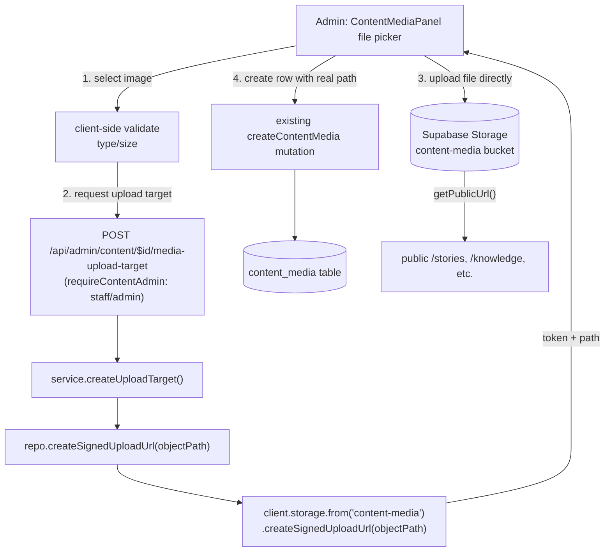

# Content Media Upload (BP-5)

**Date:** 2026-08-31
**Status:** Approved in conversation; awaiting written-spec review
**Master plan reference:** `docs/superpowers/plans/2026-08-27-public-layout-integration-v4.md` §8, BP-5 (`content-media` bucket/policies/upload UI)

## Summary

Provisions the `content-media` Storage bucket that the CMS content-media code already assumes exists, and replaces the admin's manual "type in a bucket name and storage path" form with a real file-upload flow — mirroring the signed-upload-to-Storage pattern this repo already uses for adoption-guide PDF uploads. This is one of eight independent items the master plan groups under "BP-5"; the other seven (signed adoption/sponsorship uploads, CSP enforcement, Turnstile/Upstash deploy gate, log token redaction, demo-seed guard, branch protection, `APP_URL` unification) are tracked separately and are not part of this spec.

## Current state

- `src/lib/content/repository.server.ts:308-311` (`mediaPublicUrl`) already calls `client.storage.from(row.storage_bucket).getPublicUrl(row.storage_path)` to build the `url` field consumers render — but no `content-media` bucket has ever been provisioned. Grepping every `insert into storage.buckets` statement across `supabase/migrations/*.sql` finds buckets for donation receipts, adoption-coordinator, public-adoption-journey, sponsorship-proof, and site-documents, never `content-media`. Any `content_media` row today produces a URL that 404s.
- `src/components/admin/content/ContentEditor.tsx`'s `ContentMediaPanel` (~line 1113) is a manual form: an admin types a "Storage bucket" string and a "Storage path" string, meaning they must already know (or guess) the exact object path of a file uploaded to Storage by some other means before this form can create a working row. No actual file upload happens through this UI.
- `src/lib/content/schemas.ts:117` — `storageBucket` is free-text admin input (`trimmed.min(1).max(120).default("content-media")`), accepting any bucket name, not just the intended one.
- `content_media` (table, `supabase/migrations/20260705120000_story_promotion_center.sql:79-96`) already has the right columns (`storage_bucket`, `storage_path`, `alt_text`, `caption`, `sort_order`, `is_cover`, `content_item_id`, `story_update_id`) and its own row-level RLS (service-role only) — no table changes needed.
- `MediaCard` (`ContentEditor.tsx:1251`) already renders an `` preview for existing rows and has no delete/edit affordance — creation is the only supported operation today.
- Grepping the whole `src/components/admin` tree for the "type a storage bucket/path" pattern finds it only in `ContentMediaPanel` — this is not a repeated anti-pattern elsewhere, so scope stays contained to this one screen and its supporting `content` domain files.

## Approved decisions

- **Full file-picker replacement**, not a minimal bucket-only slice and not an additional image-preview-during-upload feature. The admin picks a file from their computer; it uploads directly to Storage; the resulting path fills in automatically. Alt text, caption, cover checkbox, and sort order stay as manual fields, unchanged from today.
- **Mirror the `documents` domain's admin-authenticated signed-upload pattern** (already used for adoption-guide PDF uploads via `documentUpload.ts` / `/api/admin/documents/upload-target`), not the public anonymous `publicUploads/signedUpload.server.ts` module. That module is deliberately built for callers with no admin session yet (public adoption/sponsorship submitters); retrofitting admin auth onto it would fight its design rather than reuse it.
- **The bucket is public.** The existing `mediaPublicUrl()` call already assumes this (`getPublicUrl()` only produces a working URL for a public bucket) — this design closes that gap rather than introducing a new assumption.
- **`storageBucket` is hardcoded server-side and dropped from admin input.** Today's free-text field is a footgun (an admin could currently point a row at an arbitrary bucket name); this matches how the `documents` domain hardcodes `SITE_DOCUMENTS_BUCKET` rather than accepting it as input.
- **Image constraints reuse the existing adoption-photo precedent**: `image/jpeg` / `image/png` / `image/webp`, 8 MiB max — the same `PHOTO_MIME_TYPES` / `MAX_PHOTO_BYTES` values already established in `src/lib/publicAdoption/schemas.ts:12-13`, not new limits invented for this feature.
- **Deleting/replacing an already-uploaded file's row is out of scope** — `ContentMediaPanel` is create-only today too, so this is not a regression, just an unchanged limitation.

## Architecture

## Data model

New migration: provisions the `content-media` Storage bucket via `insert into storage.buckets (id, name, public, file_size_limit, allowed_mime_types) values ('content-media', 'content-media', true, 8388608, array['image/jpeg', 'image/png', 'image/webp']) on conflict (id) do update set public = excluded.public, file_size_limit = excluded.file_size_limit, allowed_mime_types = excluded.allowed_mime_types` — the exact idempotent-upsert shape already used for the `site-documents` bucket (`supabase/migrations/20260718100000_public_documents_and_donation_purpose.sql:117-121`), the one other `public: true` bucket in this repo (every other bucket — `receipts`, `adoption-files`, `adoption-application-photos`, `sponsorship-payment-proof` — is `public: false`). `storage.objects` RLS for this bucket is restricted to `service_role` only for `insert`/`update`/`delete` — the same shape as every other bucket in this repo — with public `select` implied by the bucket's `public = true` flag (Supabase serves public-bucket objects directly via `/storage/v1/object/public/...`, bypassing RLS for anonymous reads, which is exactly what `getPublicUrl()` already relies on).

No `content_media` table schema changes. `src/lib/content/schemas.ts`'s content-media input schema drops the `storageBucket` field entirely (server always supplies `"content-media"`); a new schema (mirroring `publicAdoption/schemas.ts`'s `validatePhotoDescriptor`) validates the upload-target request's `fileName`/`mimeType`/`sizeBytes` against the mime/size limits above.

## Upload flow

- `src/lib/content/repository.server.ts` gains `createSignedUploadUrl(objectPath: string): Promise<{ token: string; path: string }>`, calling `client.storage.from("content-media").createSignedUploadUrl(objectPath)` — same shape as `documents/repository.server.ts:494-501`'s equivalent method for `site-documents`.
- `src/lib/content/service.ts` gains `createUploadTarget(raw: unknown)`, validating the request and delegating to the repository method — same shape as `documents/service.ts:357-360`.
- `src/lib/content/http.server.ts` gains a `createUploadTarget` handler behind `requireContentAdmin` (`["staff", "admin"]`, the same role gate every other content-domain route already uses via `-handlers.ts:13`), returning `201` with `{ token, path }` — same shape as `documents/http.server.ts:170-177`.
- New route `src/routes/api/admin/content/$id/media-upload-target.ts` (a sibling file next to the existing `$id/media.ts`, not nested under it — this repo's TanStack Router file-based routing already coexists a flat `$id.ts` alongside a `$id/` directory of sub-routes at the parent level, but a route file does not itself also host a same-named child directory, so the upload-target endpoint is a sibling of `media.ts` rather than nested under it). Takes `contentItemId` from the URL `params.id`, matching how `$id/media.ts`'s `createContentMedia` already receives it — not a body param, for consistency with the existing route.
- Object path: `{contentItemId}/{crypto.randomUUID()}-{safeFileName}`, reusing the filename sanitizer already defined in `src/lib/publicUploads/signedUpload.server.ts` (`safeFileName()` strips path separators and non-alphanumeric characters).
- `ContentMediaPanel`: the "Storage bucket" and "Storage path" text `<input>`s are replaced with a single `<input type="file" accept="image/*">`. A new client-side helper (mirroring `src/components/admin/content/documentUpload.ts`'s `uploadDocumentPdf`) validates the file, requests the upload target, uploads to the signed URL, then calls the existing `createContentMedia` mutation with the resulting path. Alt text, caption, cover checkbox, and sort order fields are unchanged.

## Error handling

- Wrong file type or oversized file: rejected client-side before any network call, same message style as `uploadDocumentPdf`'s `"請選擇 PDF 檔案"` (e.g. `"請選擇 JPG、PNG 或 WEBP 圖片"` / `"圖片不可超過 8 MiB"`).
- Upload-target request failure or Storage upload failure: surfaced through `ContentMediaPanel`'s existing `pending`/error-message plumbing — no new error-handling path, just a new failure point on an already-handled channel.
- `requireAdmin` rejection on the upload-target endpoint: same 401/403 mapping already established across every other admin API route in this repo.

## Testing

- Unit tests for the three new layers (`repository.server.test.ts`, `service.test.ts`, `http.test.ts`), mirroring the existing `documents` domain's equivalent test shapes for `createUploadTarget`/`createSignedUploadUrl`.
- A real-Postgres/Storage check (this repo's established standard for RLS verification) confirming `anon` and `authenticated` cannot write to `storage.objects` for the `content-media` bucket, while `service_role` can, and that a public-bucket object is readable via its `getPublicUrl()` URL without authentication.
- `ContentMediaPanel` component test: file-picker flow calls the upload-target endpoint, then Storage upload, then `createContentMedia`, in that order, with the resulting path — mirroring how `AdoptionGuideReleaseManagement.test.tsx` or similar already test the PDF upload flow's call ordering.

## Out of scope

- Deleting or replacing an already-uploaded media item's file or row — `ContentMediaPanel` is create-only today too, not a regression introduced here.
- Image preview during upload (before the file is saved) — previews of already-created rows already render via `MediaCard`, unaffected by this change.
- The other seven items grouped under "BP-5" in the master plan (signed adoption/sponsorship uploads — already done via PR #90; CSP enforcement — already done via PR #74; Turnstile/Upstash production deploy gate; log token redaction; production demo-seed guard; branch protection on `main`; `APP_URL` default unification) — each is an independent follow-up, not part of this spec.
