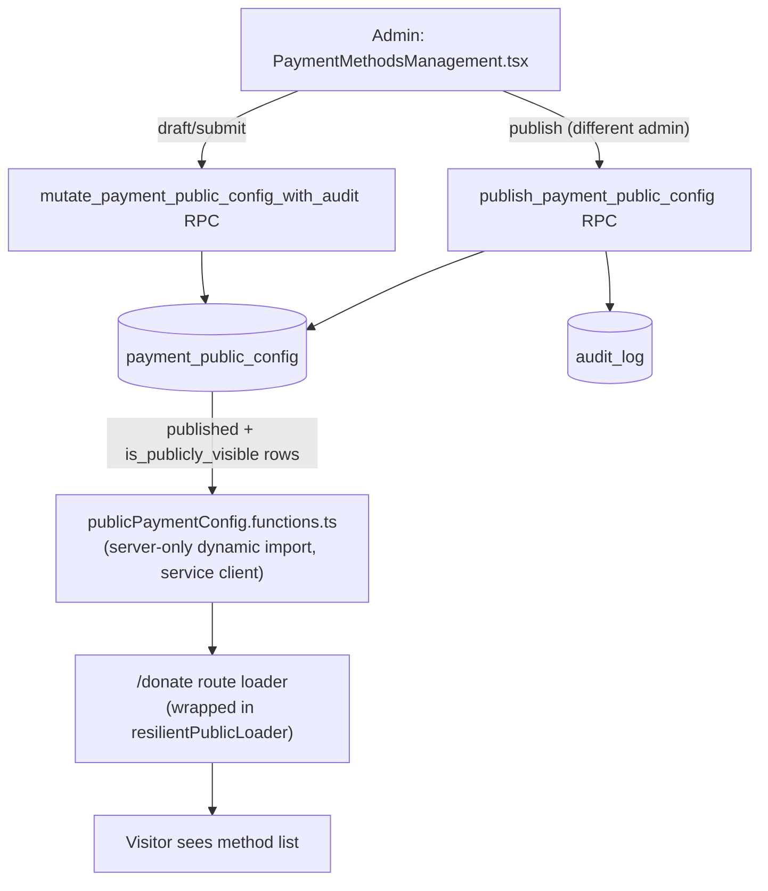

# Payment Public Config (BP-2)

**Date:** 2026-08-31
**Status:** Approved in conversation; awaiting written-spec review
**Master plan reference:** `docs/superpowers/plans/2026-08-27-public-layout-integration-v4.md` §8, BP-2

## Summary

Replaces the hardcoded donation-method list on `/donate` with a database-backed, admin-editable configuration table (`payment_public_config`), gated by a four-eyes (two-different-admins) approval workflow before any change goes live. This closes the gap where changing what payment methods or account details visitors see requires a code deploy, and where no independent review currently exists over content that tells donors where their money goes.

## Corrected premise

An earlier framing of this work assumed AlipayHK/COD was unreachable from the public donate page. That was wrong: `"alipayhk"` is already a selectable `DonationMethod` on `/donate`, and `src/lib/donations/service.ts:191,214` already maps it to the `"cod"` `PaymentProvider`. The COD gateway (`src/lib/donations/cod-*.server.ts`) is live and reachable today. This spec does not touch that mapping or the COD gateway at all — it is scoped purely to making the *display* of methods and their disclosed details config-driven and reviewable, not to fixing a broken payment path.

## Current state

- `src/routes/donate.tsx:182` — suggested amounts (`[100, 300, 500, 1000]`) are a hardcoded literal.
- `src/routes/donate.tsx:190-196` — the `methods` array (value, zh/en label, icon) for all five methods is a hardcoded literal.
- `publicDonationCheckoutEnabled` (`donate.tsx:198-199`, driven by `VITE_PUBLIC_DONATION_CHECKOUT_ENABLED`) is a separate, pre-existing all-or-nothing gate on the whole donation form. This spec does not change it.
- No `payment_public_config` table, no admin UI for payment method content, no approval workflow over this content exists today.

## Approved decisions

- **Ship disabled by default.** New config rows for methods not already live today default to `is_publicly_visible: false`. A migration seeds the five currently-live methods as already-`published`, `is_publicly_visible: true` rows carrying today's exact copy, so deploying this feature changes nothing a visitor sees until a staff member explicitly changes something.
- **Real maker-checker, enforced server-side.** A different admin than the one who submitted a change must publish it. This is stricter than the existing `adoption_guide_release` precedent (which only checks `role = 'admin'`, allowing a single admin to submit and publish their own change) — justified because incorrect payment-routing content has direct financial/trust consequences that CMS copy mistakes don't.
- **One unified table**, not a two-table split between "simple toggle" methods (Stripe/PayPal) and "disclosure" methods (FPS/PayMe/bank/AlipayHK). Every method row goes through the same review step; `details` is simply empty JSON for methods that don't need disclosed account info. Chosen over the split for simplicity — one schema, one RPC pair, one admin screen.
- **Amounts stay hardcoded.** Suggested donation amounts are out of scope for BP-2 per the master plan's own wording ("payment_public_config typed projection ... COD/AlipayHK enum alignment ... `/donate` methods API" — no amounts). Can be folded in later without changing this design's contracts.
- **Read via a server function, not a new `/api/*` route.** Matches this repo's established pattern for CMS-shaped public content (`src/lib/content/publicStory.functions.ts`): a server-only dynamic import using the service-role client, not the anon client. The `animals`-table anon+RLS pattern does not apply here — this table carries no anon grant at all, matching the C-5 rule already documented in the master plan.

## Architecture



## Data model

New migration, new table `payment_public_config`:

| Column | Type | Notes |
|---|---|---|
| `id` | `uuid primary key default gen_random_uuid()` | |
| `method` | `text not null check (method in ('stripe','payme','fps','paypal','alipayhk'))` | Matches `DonationMethod` from `src/lib/donations/contracts.ts` |
| `is_publicly_visible` | `boolean not null default false` | Whether this method shows on `/donate` when `state = 'published'` |
| `display_label_zh` | `text not null` | |
| `display_label_en` | `text not null` | |
| `sort_order` | `integer not null default 0` | |
| `details` | `jsonb not null default '{}'::jsonb` | Free-form: FPS phone, PayMe handle, bank name/number, AlipayHK/COD note. Empty for Stripe/PayPal. |
| `state` | `text not null default 'draft' check (state in ('draft','in_review','published','archived'))` | |
| `version` | `integer not null default 1 check (version > 0)` | Optimistic concurrency, same as `adoption_guide_releases` |
| `created_by`, `updated_by`, `submitted_by`, `published_by`, `archived_by` | `uuid references admin_user(id) on delete restrict` | `submitted_by`/`published_by`/`archived_by` nullable |
| `submitted_at`, `published_at`, `archived_at` | `timestamptz` | nullable |
| `created_at`, `updated_at` | `timestamptz not null default now()` | `updated_at` via the existing `set_updated_at` trigger |

Unique index: `on payment_public_config (method) where state = 'published'` — mirrors `adoption_guide_one_published_idx`. Editing a live method means creating a new draft row for that `method`, not mutating the published one; publishing the new row archives the old published row for the same method (same swap semantics as `publish_adoption_guide_release`).

RLS: enabled, `service_role` only for all of `insert/update/delete`, `authenticated` staff/admin `select` (mirroring the `adoption_guide_releases` policy shape exactly — see `20260731120000_adoption_guide_release_cms.sql:70-116`). No `anon` grant at all.

## RPCs

`mutate_payment_public_config_with_audit(p_actor_user_id, p_operation, p_config_id, p_expected_version, p_values)` — `create | update | submit | withdraw | return_to_draft | delete`, same shape, same actor/role checks, and the same `audit_log` insert pairing as `mutate_adoption_guide_release_with_audit`.

`publish_payment_public_config(p_config_id, p_expected_version, p_actor_user_id, p_idempotency_key)` — same idempotency-key/advisory-lock/version-check structure as `publish_adoption_guide_release`, with one addition: after loading the row `for update`, it must also verify

```sql
if release_to_publish.submitted_by is not null
  and release_to_publish.submitted_by = actor.id
then
  raise exception 'A different admin must publish this change' using errcode = '42501';
end if;
```

before proceeding. On success it archives the currently-published row for the same `method` (if any) and marks the new row `published`, exactly like the topic/species swap in `publish_adoption_guide_release`. Both RPCs are `security invoker`, `search_path = public, pg_temp`, granted to `service_role` only, revoked from `public/anon/authenticated` — matching the existing functions byte-for-byte in structure.

## Public read path

New `src/lib/donations/publicPaymentConfig.server.ts` (service-role client, queries `payment_public_config` where `state = 'published' and is_publicly_visible = true`, ordered by `sort_order`) behind a server-only dynamic import from a new `src/lib/donations/publicPaymentConfig.functions.ts` TanStack server function — matching `publicStory.functions.ts`'s established shape. Returns `{ method: DonationMethod; displayLabelZh: string; displayLabelEn: string; details: Record<string, unknown> }[]`.

`donate.tsx`'s route `loader` calls this through `resilientPublicLoader` (`src/lib/routing/resilientLoader.ts`, already used elsewhere for exactly this shape of resilience) so a Supabase outage renders the existing E! state (`PublicStateShell`) rather than a 500, per this repo's SSR-resilience convention. The component drops its hardcoded `methods` array entirely and renders from loader data; if the config table is ever legitimately empty (should not happen after the seed migration, but defensively), the form shows the same "no methods available" empty state used elsewhere, not a crash.

A seed migration inserts the five current methods as `published`, `is_publicly_visible: true` rows with today's exact zh/en labels — so this ships with zero visible change.

## Admin UI

New `src/components/admin/content/PaymentMethodsManagement.tsx`, following the existing `FaqManagement.tsx` / `AdoptionRulesManagement.tsx` / `CareTopicsManagement.tsx` list → edit → submit → review shape (same admin route/API layering: route → `-handlers.ts` → `lib/donations/http.server.ts` (new) → `lib/donations/service.ts` (extended) → `lib/donations/repository.server.ts` (extended), per this repo's standard layered architecture). One UI-level addition beyond the CMS precedent: when a draft has no *other* eligible admin to approve it (i.e., the only signed-in admin is the submitter), the Publish action is disabled with an explanatory message, rather than relying solely on the RPC's rejection — the RPC check remains the actual enforcement boundary; the UI state is just to avoid a confusing "click, then get an error" round trip.

## Error handling

- **Version conflict** (`errcode 40001`, stale `version`): same "someone else edited this — reload" UX already used for other CMS admin screens.
- **Same-actor publish attempt** (`errcode 42501`): admin UI shows "A different admin must approve this" instead of a generic error; the RPC is still the enforcement point (never trust the UI-level disable alone).
- **Public read failure**: `resilientPublicLoader` → `PublicStateShell` error state with retry, never a 500.
- **Empty config** (defensive only, should not occur post-seed): render the same empty-state pattern other public list views already use.

## Testing

- **Real Postgres container** (this repo's established standard for RLS/migration verification): `anon` has zero access to `payment_public_config`; a `staff`-role admin can create/edit/submit a draft but cannot publish; an `admin`-role actor **cannot** publish a row they themselves submitted (`errcode 42501`); a different admin publishing correctly archives the prior published row for that `method` and inserts the expected `audit_log` rows; `create/update/submit/withdraw/return_to_draft/delete` all behave per the state checks above.
- **Service/repository unit tests** with dependency-injected fakes, mirroring the existing `donations` domain test style.
- **`donate.tsx` component tests**: renders methods from loader data (not the old hardcoded array), renders the E! state when the loader reports `status: "error"`, renders the empty state on an empty list.
- **Admin UI tests**: list/create/edit/submit flow; the same-actor-blocked case (Publish disabled and, separately, a direct RPC-call test proving the server-side rejection independent of the UI).

## Out of scope

- Suggested donation amounts (`amounts` array in `donate.tsx`) — stays hardcoded.
- Any change to the AlipayHK→COD provider mapping, the COD gateway itself, or `PaymentProvider`/`OnlinePaymentProvider` types in `src/lib/donations/contracts.ts`.
- `VITE_PUBLIC_DONATION_CHECKOUT_ENABLED` — the existing all-or-nothing checkout gate is untouched.
- Enabling any method that isn't already live today (e.g. actually turning on a sixth method) — that stays a manual admin decision made through the new UI after this ships, not part of this feature's initial data.
