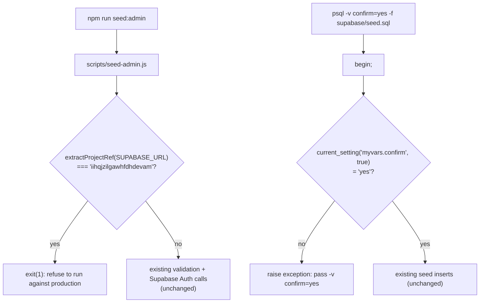

# Production Demo-Seed Guard (BP-5)

**Date:** 2026-09-01
**Status:** Approved in conversation; awaiting written-spec review
**Master plan reference:** `docs/superpowers/plans/2026-08-27-public-layout-integration-v4.md` §8, BP-5 (production demo-seed guard)

## Summary

Adds two independent guards, one per demo-seeding script, so neither can accidentally run against the live production Supabase project (project ref `iihqjzilgawhfdhdevam`). This is one of five remaining independent items grouped under "BP-5" in the master plan (the other four — Turnstile/Upstash production deploy gate, log token redaction, branch protection on `main`, `APP_URL` default unification — are tracked separately and are not part of this spec).

## Current state

- `scripts/seed-admin.js` — a standalone Node script (run via `npm run seed:admin`) that reads `.env`/`.env.local` plus `process.env` for `VITE_SUPABASE_URL`/`SUPABASE_SERVICE_ROLE_KEY`, then calls `supabase.auth.admin.createUser`/`updateUserById` and upserts an `admin_user` row. Its own docstring frames it purely as a local dev tool ("Creates or updates an admin user... so you can log in at http://localhost:8080/admin/login"). It has **no environment check at all** today — it will happily create or overwrite a real Supabase Auth user and `admin_user` row on whatever project `SUPABASE_URL` happens to point to, including production, if a developer's local env file has production credentials in it (e.g. copy-pasted for an unrelated debugging session and never removed).
- `supabase/seed.sql` — a 539-line pure-SQL file (`begin; set local timezone to 'Asia/Hong_Kong'; ...`) inserting fixed-ID demo reference/domain data (living areas, arrival sources, shelters, adoption fees, and more further down the file) via `on conflict ... do update` upserts. Its own comment already states "Domain data only: this file must not create Supabase Auth users or admin_user rows" — confirmed true by inspection, this boundary already holds. It has **no npm script and no CI reference anywhere in this repo** (`grep -rn "seed" package.json .github/workflows/*.yml` finds only `seed:admin`) — the only ways to run it are manually via `psql -f supabase/seed.sql` or pasting it into the Supabase Dashboard SQL editor. It therefore has zero programmatic way to know which project it's connected to.
- `src/lib/security/turnstile.server.ts`'s `isProductionRuntime()` (checks `VERCEL_ENV`/falls back to `NODE_ENV`) is this repo's only existing "are we in production" helper. It answers a different question — "is this code running in a deployed Vercel environment" — not "did a local `.env` file happen to point at the production database." `scripts/seed-admin.js` runs on a developer's own machine, where `VERCEL_ENV` is never set regardless of which Supabase project the credentials target, so this helper does not apply here and is not reused.
- No file in this codebase (`src/`) references the production project ref `iihqjzilgawhfdhdevam` in code today — it appears only in `CLAUDE.md` documentation.

## Approved decisions

- **Two separate guards, not one shared mechanism** — the two scripts have fundamentally different environment awareness (one has real env-var access, one is pure SQL with none), so a single shared check isn't possible; each gets the strongest guard actually available to it.
- **`seed-admin.js`: hard block, no override.** If the project ref extracted from `SUPABASE_URL` matches `iihqjzilgawhfdhdevam`, the script exits with an error before making any Supabase API call — no environment variable or flag can bypass this. The script's own docstring already documents no legitimate production use case, and this repo's real production admin accounts were presumably created directly via the Supabase Dashboard, not this script.
- **`seed.sql`: an explicit, conscious opt-in flag, not project-ref detection.** Since this file cannot introspect which project it's connected to, the guard instead requires every invocation to pass `psql -v confirm=yes -f supabase/seed.sql`; a missing or wrong value aborts the transaction via `raise exception` before any row is touched. This does not detect production — it converts an accidental run (wrong connection string, muscle memory, pasting into the wrong Dashboard tab) from "just works" into "requires a deliberate extra step," which is the only genuine safeguard available to a file with no environment awareness.

## Architecture



## `seed-admin.js` changes

A new pure function, `extractProjectRef(supabaseUrl)`, parses the Supabase URL's subdomain (`https://<ref>.supabase.co` → `<ref>`) via a regex; returns `null` if the URL doesn't match the expected Supabase hostname shape (fails safe — an unparseable URL is NOT treated as a production match, so a genuinely different/self-hosted Supabase instance isn't blocked by this specific check, though the script's existing `SUPABASE_URL` presence check still applies).

A new constant, `const PRODUCTION_PROJECT_REF = "iihqjzilgawhfdhdevam";`, placed near the script's existing `SUPABASE_URL`/`SERVICE_KEY` constant declarations.

The guard runs immediately after `SUPABASE_URL` is resolved and before any of the script's existing validation checks (`SERVICE_KEY`/`ADMIN_EMAIL`/`ADMIN_PASSWORD`/`ADMIN_ROLE`):

```js
if (extractProjectRef(SUPABASE_URL) === PRODUCTION_PROJECT_REF) {
  console.error("✗ Refusing to run against the production Supabase project.");
  console.error(`  Detected project ref: ${PRODUCTION_PROJECT_REF}`);
  console.error("  This script is a local development tool only. To manage a production");
  console.error("  admin account, use the Supabase Dashboard directly.");
  process.exit(1);
}
```

No other part of the script's existing behavior (env loading, validation order for the other four checks, the actual Auth/`admin_user` upsert logic, console output on success) changes.

## `seed.sql` changes

A new `do $$ ... $$;` block is inserted as the file's first statement after `begin; set local timezone to 'Asia/Hong_Kong';`:

```sql
do $$
begin
  if current_setting('myvars.confirm', true) is distinct from 'yes' then
    raise exception
      'Refusing to run supabase/seed.sql without explicit confirmation. '
      'Re-run as: psql <connection-string> -v confirm=yes -f supabase/seed.sql '
      '(or set myvars.confirm = ''yes'' before running this file in the Supabase '
      'Dashboard SQL editor).';
  end if;
end $$;
```

`psql`'s `-v confirm=yes` sets a `psql` variable, not a Postgres session `GUC` — the file's top must also map it, since `current_setting` reads session-level settings, not `psql` client-side variables. The actual top-of-file addition is therefore two parts: the `\set` (or an equivalent `-v`-driven substitution `psql` performs automatically on `:confirm` references) is not reliable across both `psql` and the Dashboard SQL editor (which doesn't run `psql` variable substitution at all), so the file instead sets the GUC directly from a `psql`-substituted value at the top:

```sql
set local myvars.confirm = :'confirm';
```

placed directly after `set local timezone to 'Asia/Hong_Kong';` and before the `do $$ ... $$;` guard above. When run via `psql -v confirm=yes -f supabase/seed.sql`, `:'confirm'` substitutes to the quoted literal `'yes'`. When pasted into the Supabase Dashboard SQL editor (no `psql` variable substitution available), `:'confirm'` is not substituted at all and Postgres raises its own syntax/parse error immediately — which still prevents the seed from silently running, satisfying the same "no silent accidental run" goal, just with a less friendly error message in that one path. The Dashboard-specific case is called out explicitly in code comments so a future maintainer isn't confused by the two different failure shapes.

No other line in `seed.sql` changes — the actual seed data, table order, and upsert logic are all untouched.

## Error handling

- `seed-admin.js`: exits with status 1 and a clear, actionable message (matches the script's existing style for its other four validation failures) before any network call — no partial state, no risk of a half-completed Auth user or `admin_user` row.
- `seed.sql`: the `raise exception` aborts the whole `begin ... commit` transaction (the file already wraps everything in `begin;`/presumably ends in `commit;`) — no partial seed rows are written whether the guard trips via the explicit `raise exception` (missing `-v confirm=yes` in `psql`) or via a Postgres parse error (Dashboard SQL editor with no substitution).

## Testing

- `extractProjectRef`'s logic is extracted so it can be unit-tested directly with `bun:test` against a table of inputs: a real-shaped production URL (matches), a different valid Supabase URL (no match), a malformed/non-Supabase URL (returns `null`, no match), and `undefined`/empty string (no match). This is new test coverage for a script that has none today — reasonable and low-risk to add given the function is now a small, pure, exported unit.
- The production-ref hard-block itself is verified with one additional test: given `SUPABASE_URL` set to the exact production shape, the script's top-level guard function returns/would trigger `exit(1)` — tested by extracting the check into the same testable module rather than asserting on `process.exit` side effects directly (matching how this repo generally avoids testing through `process.exit`).
- `seed.sql`'s guard is verified manually against a disposable Postgres container (same minimal-scope approach used for the content-media migration's Task 8): confirm `psql ... -f supabase/seed.sql` (no `-v confirm`) aborts before any insert runs, and `psql ... -v confirm=yes -f supabase/seed.sql` proceeds and seeds normally. This is a manual verification step, not an automated test, since `seed.sql` has no test harness in this repo today and adding one is out of scope.

## Out of scope

- Any change to `seed.sql`'s actual seed data, table order, or upsert logic.
- Adding an npm script or CI step to invoke `seed.sql` — it stays a manual, no-tooling file, matching how it's used today.
- The other four BP-5 items (Turnstile/Upstash production deploy gate, log token redaction, branch protection on `main`, `APP_URL` default unification) — each is an independent follow-up, not part of this spec.
- Any change to `isProductionRuntime()` or its Vercel-runtime-based usage elsewhere — this spec introduces a separate, purpose-specific check rather than extending that helper, since the two questions ("is this a deployed Vercel environment" vs. "does this Supabase URL point at production") are genuinely different.
