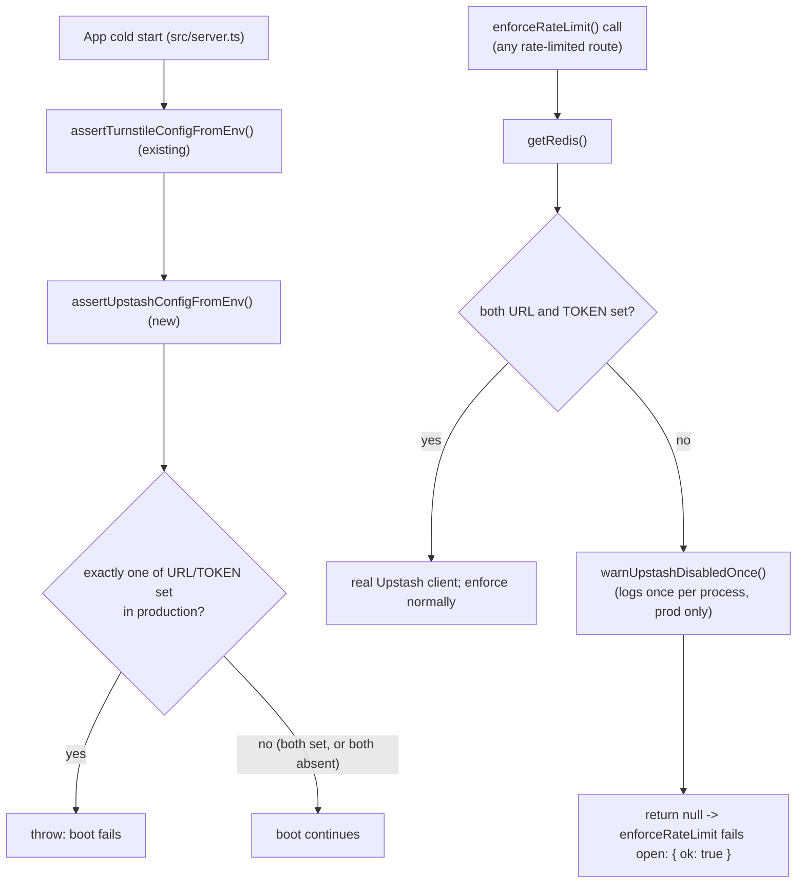

# Upstash Production Deploy Gate (BP-5)

**Date:** 2026-09-01
**Status:** Approved in conversation; awaiting written-spec review
**Master plan reference:** `docs/superpowers/plans/2026-08-27-public-layout-integration-v4.md` §8, BP-5 ("Turnstile/Upstash production deploy gate")

## Summary

Adds a boot-time assertion and a one-time runtime warning to `src/lib/security/rate-limit.server.ts`, mirroring the two-tier pattern that already exists for Cloudflare Turnstile in `src/lib/security/turnstile.server.ts`. This closes half of the BP-5 "Turnstile/Upstash production deploy gate" item — the Turnstile half is already implemented and wired into `src/server.ts`; only the Upstash half is missing today. This is one of four remaining independent items grouped under "BP-5" in the master plan (the other three — log token redaction, branch protection on `main`, `APP_URL` server-side default unification — are tracked separately and are not part of this spec).

## Current state

- `src/lib/security/turnstile.server.ts` has two safety mechanisms for production:
  - `assertTurnstileConfig`/`assertTurnstileConfigFromEnv`: throws at boot if exactly one of `VITE_TURNSTILE_SITE_KEY`/`TURNSTILE_SECRET_KEY` is set in production (an inconsistent pair either breaks every submission or silently disables the CAPTCHA). Called from `src/server.ts:10` at cold start.
  - `warnTurnstileDisabledOnce`: logs a `console.error` exactly once per process when `TURNSTILE_SECRET_KEY` is unset in production, fired lazily from inside `verifyTurnstile`'s fail-open branch (i.e., on the first actual verification attempt, not at boot).
- `src/lib/security/rate-limit.server.ts` has neither mechanism today. `getRedis()` (lines 88-95) builds the Upstash client only if **both** `UPSTASH_REDIS_REST_URL` and `UPSTASH_REDIS_REST_TOKEN` are set; if only one is set, or neither, `getRedis()` returns `null` and `enforceRateLimit` silently returns `{ ok: true }` (fails open) with no warning of any kind — confirmed by reading the full file. `src/lib/environmentContract.test.ts` has no `UPSTASH_*` assertions at all (confirmed via grep — zero matches).
- `CLAUDE.md` and `src/server.ts`'s own comments already document that both Turnstile and Upstash are meant to fail open when unconfigured — this spec does not change that behavior, only makes the "unconfigured in production" and "misconfigured pair" cases loud instead of silent.
- `isProductionRuntime(env)` (in `turnstile.server.ts`) is the shared "are we in a deployed production environment" check (`VERCEL_ENV === "production"`, falling back to `NODE_ENV === "production"`) — this spec imports and reuses it rather than duplicating it.

## Approved decisions

- **Two-tier gate, mirroring Turnstile exactly:**
  1. **Hard boot-fail on a partial pair.** If exactly one of `UPSTASH_REDIS_REST_URL`/`UPSTASH_REDIS_REST_TOKEN` is set in production, throw at boot. A partial pair has no legitimate cause — it's almost always a typo in one of the two variable names — so it gets the same severity as Turnstile's inconsistent-pair case.
  2. **One-time warning when fully unconfigured.** If both are simply absent in production, do not fail boot (this may be an intentional, deferred rollout of rate limiting) — instead log a `console.error` exactly once, the first time `getRedis()` resolves to the unconfigured state, mirroring `warnTurnstileDisabledOnce`'s lazy, once-per-process firing.
- **No behavior change to `enforceRateLimit` itself.** It still returns `{ ok: true }` in every fail-open case (unconfigured, or a Redis call error). This spec only adds visibility, not new blocking behavior.
- **Reuse `isProductionRuntime` from `turnstile.server.ts`** rather than duplicating the Vercel/NODE_ENV detection logic in `rate-limit.server.ts`.

## Architecture



## `rate-limit.server.ts` changes

Two new exported functions, placed near the top of the file alongside the existing `getClientIp`/`clientIpFromHeaders` exports:

```ts
import { isProductionRuntime } from "./turnstile.server";

export function assertUpstashConfig(config: {
  url?: string | null;
  token?: string | null;
  isProduction: boolean;
}): void {
  if (!config.isProduction) return;
  const hasUrl = Boolean(config.url);
  const hasToken = Boolean(config.token);
  if (hasUrl === hasToken) return;
  throw new Error(
    "Upstash misconfiguration: set BOTH UPSTASH_REDIS_REST_URL and UPSTASH_REDIS_REST_TOKEN, " +
      `or neither. Got URL ${hasUrl ? "set" : "MISSING"}, token ${hasToken ? "set" : "MISSING"}. ` +
      "A partial pair almost always means a typo in one of the two variable names.",
  );
}

export function assertUpstashConfigFromEnv(env: NodeJS.ProcessEnv = process.env): void {
  assertUpstashConfig({
    url: env.UPSTASH_REDIS_REST_URL,
    token: env.UPSTASH_REDIS_REST_TOKEN,
    isProduction: isProductionRuntime(env),
  });
}
```

`getRedis()` (existing, lines 88-95) gains one call in its `null`-returning branch:

```ts
function getRedis(): Redis | null {
  if (cachedRedis !== undefined) return cachedRedis;
  const url = process.env.UPSTASH_REDIS_REST_URL;
  const token = process.env.UPSTASH_REDIS_REST_TOKEN;
  if (!(url && token)) warnUpstashDisabledOnce();
  cachedRedis = url && token ? new Redis({ url, token }) : null;
  return cachedRedis;
}
```

New module-level warning helper, placed directly above `getRedis()`:

```ts
let warnedUpstashDisabled = false;
function warnUpstashDisabledOnce(): void {
  if (warnedUpstashDisabled) return;
  warnedUpstashDisabled = true;
  if (isProductionRuntime()) {
    console.error(
      "UPSTASH_REDIS_REST_URL/UPSTASH_REDIS_REST_TOKEN not set in production: rate limiting is " +
        "DISABLED (failing open). This should only happen when rate limiting is intentionally " +
        "turned off.",
    );
  }
}
```

Note `warnUpstashDisabledOnce` is called unconditionally from `getRedis()`'s unconfigured branch (both the "both absent" and the "exactly one set" cases reach it), but only logs when `isProductionRuntime()` is true — matching `warnTurnstileDisabledOnce`'s own structure exactly. In production, the "exactly one set" case will already have been caught by `assertUpstashConfigFromEnv` at boot and never reach a live request; the warning firing there too is harmless redundancy, not a gap, and keeping the check simple (no need to distinguish the two unconfigured shapes at the warning site) is preferred over adding branching that boot already prevents from mattering.

## `server.ts` changes

One new import and one new call, directly beside the existing Turnstile ones:

```ts
import { assertTurnstileConfigFromEnv } from "./lib/security/turnstile.server";
import { assertUpstashConfigFromEnv } from "./lib/security/rate-limit.server";

// Fail the cold start loudly if the client/server Turnstile config is
// inconsistent (secret-only -> 403 outage; site-key-only -> silent bypass).
assertTurnstileConfigFromEnv();

// Fail the cold start loudly if only one of the two Upstash env vars is set
// (almost always a typo) -- a fully-unconfigured pair is allowed and only
// logged once, lazily, on first use (see warnUpstashDisabledOnce).
assertUpstashConfigFromEnv();
```

## Error handling

- Boot-time: `assertUpstashConfigFromEnv` throws a plain `Error` with an actionable message (which env var is set vs. missing) — this propagates out of `src/server.ts`'s module-level call exactly like Turnstile's existing assertion does, crashing the cold start before any request is served. No partial-request state is possible since this runs before the `fetch` handler is even defined.
- Runtime: `warnUpstashDisabledOnce` never throws — it only logs. `enforceRateLimit`'s existing try/catch and fail-open behavior are unchanged.

## Testing

New tests added to the existing `src/lib/security/rate-limit.server.test.ts`, in a new `describe("assertUpstashConfig", ...)` block mirroring `turnstile.server.test.ts`'s coverage of `assertTurnstileConfig`:
- both `url` and `token` set, production → does not throw
- both absent, production → does not throw
- `url` only, production → throws with a message naming which var is missing
- `token` only, production → throws with a message naming which var is missing
- any of the above pair states, non-production → never throws

A second `describe("assertUpstashConfigFromEnv", ...)` block verifies it reads from a passed-in env object (mirroring `assertTurnstileConfigFromEnv`'s existing test, if one exists — confirm and match its exact style during implementation).

`warnUpstashDisabledOnce` is **not** unit-tested, matching the precedent: `turnstile.server.test.ts` has zero tests for `warnTurnstileDisabledOnce` today (confirmed by grep — no matches), for the same reason it would apply here — the function has private, module-level, once-per-process state (`warnedUpstashDisabled`) that is awkward to reset between test cases, and its only effect is a `console.error` call, not a return value or thrown error that changes program behavior.

## Out of scope

- Any change to `enforceRateLimit`'s fail-open return value or the try/catch around the actual Upstash `.limit()` call.
- Any change to Turnstile's existing code.
- The other three remaining BP-5 items (log token redaction, branch protection on `main`, server-side `APP_URL` default unification) — each is an independent follow-up, not part of this spec.
- Adding a test for `warnUpstashDisabledOnce`'s logging behavior — matches the existing precedent's untested state for the equivalent Turnstile function.
