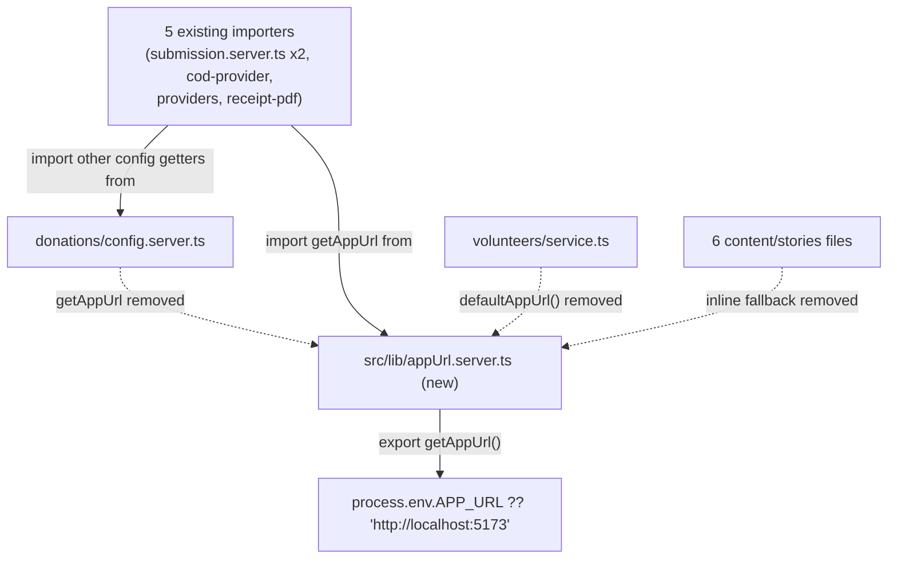

# APP_URL Default Unification (BP-5, G-20 server-side half)

**Date:** 2026-09-02
**Status:** Approved in conversation; awaiting written-spec review
**Master plan reference:** `docs/superpowers/plans/2026-08-27-public-layout-integration-v4.md` §8, BP-5 ("unify `APP_URL` defaults (G-20)")

## Summary

Unifies the server-side `APP_URL` fallback default (used when the `APP_URL` env var itself is unset) across every call site in the codebase, by promoting the existing `getAppUrl()` function out of `src/lib/donations/config.server.ts` into a new shared file, `src/lib/appUrl.server.ts`, and fixing its default from `http://localhost:3000` to `http://localhost:5173` in the move. This is the server-side half of defect G-20; the client-rendered-HTML half (`PUBLIC_SITE_ORIGIN`/`publicUrl()` in `src/lib/publicOrigin.ts`, used for canonicals/OG tags) was already completed under WP-0b and is out of scope here. This is one of three remaining independent items grouped under "BP-5" in the master plan (the other two — log token redaction, branch protection on `main` — are tracked separately and are not part of this spec).

## Current state

- `src/lib/donations/config.server.ts:17-19` exports `getAppUrl()`, returning `process.env.APP_URL ?? "http://localhost:3000"`. This function already has **5 real importers** across the donations/adoption/sponsorship domains:
  - `src/lib/publicAdoption/submission.server.ts:16` — `import { getAppUrl, getEmailConfig } from "../donations/config.server";`
  - `src/lib/sponsorship/submission.server.ts:19` — same pattern, importing `getEmailConfig` alongside it
  - `src/lib/donations/cod-provider.server.ts:3` — `import { getAppUrl, getCodConfig, type CodConfig } from "./config.server";`
  - `src/lib/donations/providers.server.ts:4` — `import { getAppUrl, getPayPalConfig, getStripeConfig } from "./config.server";`
  - `src/lib/donations/receipt-pdf.server.ts:5` — `import { getAppUrl, getReceiptConfig } from "./config.server";`
- Six other files independently duplicate the same fallback pattern inline, all using the *correct* `:5173` default (confirmed by reading each):
  - `src/lib/volunteers/service.ts:102-104` — via a private, unexported `defaultAppUrl()` helper
  - `src/lib/content/publicStoriesPage.server.ts:66`
  - `src/lib/content/publicStory.functions.ts:20` (has a comment: "Same default as the rest of the content module. A deployment hostname here would silently outlive decision D-1.")
  - `src/routes/api/admin/content/-handlers.ts:11`
  - `src/routes/api/stories.ts:10`
  - `src/routes/api/stories/map.ts:10`
  - `src/routes/api/stories/$slug.ts:10`
- Two test files hardcode the current `:3000` default as an expected value in their assertions and will break once the default changes to `:5173`:
  - `src/lib/donations/cod-provider.server.test.ts:60` — `returnUrl: "http://localhost:3000/donate?status=pending&donation=donation-123"`
  - `src/lib/sponsorship/submission.server.test.ts:416` — `statusUrl: "http://localhost:3000/sponsors/status/token"`
- `src/lib/publicOrigin.ts:17-18` already has an explicit comment: "Server-side APP_URL fallbacks are deliberately not unified here; they belong to BP-5 with the deployment environment" — confirming this work's scope and that it was consciously deferred, not overlooked.
- `src/lib/environmentContract.test.ts:52-61` asserts `.env.example`'s `VITE_PUBLIC_SITE_ORIGIN` value equals its `APP_URL` value — this is about the two variables' *documented default values* agreeing with each other in `.env.example`, not about either variable's in-code fallback constant. Not affected by this change (confirmed by reading the test).

## Approved decisions

- **Unify to `:5173`, not `:3000`.** Six of the eight fallback sites already use `:5173` (Vite's actual dev server port for this app); only `donations/config.server.ts` uses `:3000`, with no comment or historical justification found for the difference — it reads as an unnoticed inconsistency, not a deliberate choice. Treated as the bug being fixed here, not the target to converge on.
- **New shared file (`src/lib/appUrl.server.ts`), not per-file literal fixes.** A new shared function eliminates the duplication that let `:3000`/`:5173` drift apart unnoticed in the first place; simply correcting the one wrong literal would leave eight independent copies of the same fallback string, still able to drift again on a future edit.
- **Reuse the existing `getAppUrl()` name**, moved rather than reinvented — it's already an established, sensibly-named function with 5 real call sites; renaming it would only add churn.
- **Do not touch `src/lib/publicOrigin.ts`/`PUBLIC_SITE_ORIGIN`.** That's a different variable (`VITE_PUBLIC_SITE_ORIGIN`, client-visible, used for canonical/OG URLs) serving a different purpose (public-facing HTML metadata vs. server-side link construction for emails/receipts/redirects) and was already unified under WP-0b.

## Architecture



## `appUrl.server.ts` (new file)

```ts
/**
 * The server-side base URL for links built into emails, receipts, and
 * redirect/callback URLs (donation return URLs, receipt PDF asset URLs,
 * status-page links). Distinct from PUBLIC_SITE_ORIGIN in publicOrigin.ts,
 * which is for client-rendered HTML (canonicals, Open Graph tags) and reads
 * a different, client-visible env var (VITE_PUBLIC_SITE_ORIGIN).
 *
 * Defect G-20 (server-side half): this fallback used to be duplicated
 * across eight call sites, with donations/config.server.ts's copy carrying
 * a stale :3000 default while every other copy already used Vite's actual
 * dev server port, :5173. Unified here so there is exactly one fallback to
 * keep correct.
 */
export function getAppUrl(): string {
  return process.env.APP_URL ?? "http://localhost:5173";
}
```

## Changes to existing files

- **`src/lib/donations/config.server.ts`**: remove the `getAppUrl` export (lines 17-19). All other exports (`getEmailConfig`, `getCodConfig`, `getPayPalConfig`, `getStripeConfig`, `getReceiptConfig`) are untouched.
- **5 existing importers** (`publicAdoption/submission.server.ts`, `sponsorship/submission.server.ts`, `donations/cod-provider.server.ts`, `donations/providers.server.ts`, `donations/receipt-pdf.server.ts`): split their single combined import line into two — one importing `getAppUrl` from the new `appUrl.server.ts` (via the correct relative path from each file's location), one importing their other config getter(s) from `./config.server` or `../donations/config.server` as before. No call-site logic changes; every existing `getAppUrl()` call keeps working identically once the import path is updated.
- **`src/lib/volunteers/service.ts`**: delete the private `defaultAppUrl()` function; replace its call site with an imported `getAppUrl()` from `../appUrl.server`.
- **6 content/stories files** (`content/publicStoriesPage.server.ts`, `content/publicStory.functions.ts`, `routes/api/admin/content/-handlers.ts`, `routes/api/stories.ts`, `routes/api/stories/map.ts`, `routes/api/stories/$slug.ts`): replace `process.env.APP_URL ?? "http://localhost:5173"` with an imported `getAppUrl()` call.
- **2 test files** (`donations/cod-provider.server.test.ts`, `sponsorship/submission.server.test.ts`): update the hardcoded `localhost:3000` expected value to `localhost:5173`.

## Error handling

No new error paths — `getAppUrl()` is a pure, synchronous function that always returns a string (either the env var's value or the fallback). No behavior changes anywhere except the one bug fix (donations-domain links built without `APP_URL` set now default to the correct dev port, `:5173`, instead of `:3000`).

## Testing

New `src/lib/appUrl.server.test.ts`:
- Returns the fallback (`http://localhost:5173`) when `APP_URL` is unset.
- Returns the real value when `APP_URL` is set (via a passed-in env object or a temporarily-set `process.env.APP_URL`, matching whichever pattern this repo's other simple env-fallback tests already use — confirm the established style during implementation).

The 5 existing importers' own test suites are unaffected in behavior (they already exercise `getAppUrl()` indirectly through their own tests, if any) except where they hardcode the literal default value — the 2 identified test files get their `:3000` updated to `:5173`.

## Out of scope

- Any change to `src/lib/publicOrigin.ts`, `PUBLIC_SITE_ORIGIN`, or `VITE_PUBLIC_SITE_ORIGIN` — already unified under WP-0b, a different variable/purpose.
- Any change to what `APP_URL` is actually set to in real Vercel deployments — this only touches the local-dev fallback used when the env var is unset.
- The other two remaining BP-5 items (log token redaction, branch protection on `main`) — each is an independent follow-up, not part of this spec.
