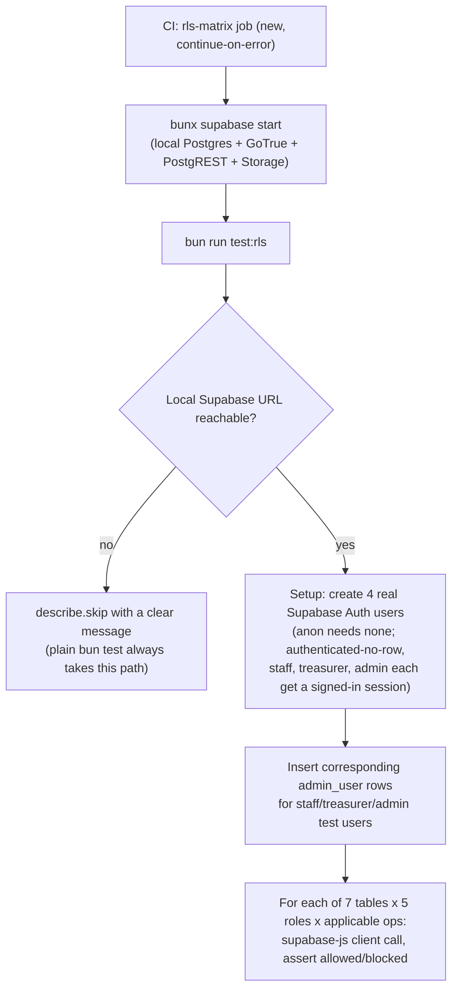

# RLS Behavioral Test Harness — v1: Money/PII Tables (Phase 4)

**Date:** 2026-09-02
**Status:** Approved in conversation; awaiting written-spec review
**Master plan reference:** `docs/superpowers/plans/2026-08-27-public-layout-integration-v4.md`, Phase 4 ("RLS matrix")

## Summary

Adds the first genuine *behavioral* RLS test suite to this repo — one that actually executes a query as a specific role and checks whether Postgres allows or blocks it — scoped to the 7 highest-risk tables (money/PII): `admin_user`, `supporter`, `donation`, `payment`, `receipt`, `consent`, `recurring_mandate`. This is one of seven independent items scoped under "Phase 4: Non-functional" in the master plan (the other six — payment sandbox, a11y, bilingual, performance, backup drill, owner UAT — are tracked separately and are not part of this spec). Extending this harness to the remaining ~56 RLS-enabled tables is an explicit, separate follow-up once this harness and matrix format are proven.

## Current state

- Every table in this schema has RLS enabled (confirmed: 63/63 tables), and 79 active policies exist, but **every existing RLS-related test is a string-match against migration SQL text** (`supabaseMigrations.test.ts` and 4 other files) — none executes a real query as a real role and observes actual allow/deny behavior.
- Read directly from `supabase/migrations/20260623160506_phase_2_donations_mvp.sql`: all 7 target tables' policies apply `to authenticated` as a single Postgres role. Role differentiation (staff/treasurer/admin) happens *inside* each policy body via `private.has_admin_role(array[...])`, a `security definer` function that resolves `auth.uid()` (a Supabase Auth JWT claim, read via `current_setting('request.jwt.claims', true)`) to a lookup in `public.admin_user` and checks its `role` column (`'staff' | 'treasurer' | 'admin'`, enforced by a `check` constraint on the table).
- `auth.uid()` and the surrounding `auth` schema are **Supabase-platform bootstrap**, not created by this repo's own migrations — confirmed earlier this session while investigating an unrelated feature (`production-demo-seed-guard`): a bare `postgres:16-alpine` container has no `auth` schema, no `anon`/`authenticated`/`service_role` Postgres roles, and no `storage` schema. Genuine behavioral RLS testing therefore requires a real local Supabase stack, not a bare Postgres container with migrations replayed.
- The Supabase CLI is not currently installed and no `supabase/config.toml` exists in this repo (confirmed by checking for the file). Docker Desktop's daemon was confirmed running at design time (`docker info` succeeded), unlike two earlier points this session where it was down — this is inherently an environment-dependent precondition, not a fixed fact about this repo.
- `@supabase/supabase-js` (`^2.108.1`) is already a dependency; no raw Postgres client (`pg`/`postgres`) exists in `package.json` today, and this design does not add one.
- `package.json`'s only test script is `"test": "bun test"`, which scans the whole tree by Bun's default `**/*.test.ts` convention. There is no existing "requires a live external service" test tier in this repo — every current test uses dependency-injected fakes.
- `.github/workflows/ci.yml` has a precedent for a non-blocking-then-promoted job: `brand-verify` (separate job, `needs: verify`, previously `continue-on-error: true`, promoted to a required branch-protection check this session in commit `2ce7f80` after being green 5+ times).

## Approved decisions

- **Scope to the 7 money/PII tables for v1** (`admin_user`, `supporter`, `donation`, `payment`, `receipt`, `consent`, `recurring_mandate`), not all 63 RLS-enabled tables. Proves the harness and matrix format once on the highest-stakes tables; extending to the rest is mechanical follow-up, not a redesign.
- **5 roles tested per table**, refined from the original framing during design: `anon` (unauthenticated); `authenticated` with no `admin_user` row (a real signed-in user who isn't staff — a genuinely untested case today, since every existing check assumes either full public/anon access or an admin_user); `authenticated` + `admin_user.role = 'staff'`; `authenticated` + `admin_user.role = 'treasurer'`; `authenticated` + `admin_user.role = 'admin'`. `service_role` is explicitly excluded from the matrix — it has Postgres `BYPASSRLS` by design, so "service_role bypasses RLS" is an architectural fact to state, not a per-table policy to verify.
- **Real local Supabase stack via CLI, not a bare-Postgres stand-in.** A hand-rolled `auth.uid()`/`auth` schema approximation was considered and rejected — it would test against a reimplementation of Supabase's semantics rather than the real platform, risking false confidence.
- **`@supabase/supabase-js` against the real PostgREST endpoint, not raw SQL session manipulation.** Sign in real local Supabase Auth users per role and call `.select()/.insert()/.update()/.delete()` through the same HTTP → PostgREST → Postgres path production traffic uses. No new dependency needed.
- **Tests self-skip when the local stack isn't reachable**, rather than fighting Bun's test-discovery glob or introducing new `bunfig.toml` scoping. A fast reachability check at the top of the suite `describe.skip`s with a clear message when the local Supabase URL doesn't respond. Plain `bun test` (the existing, fast, fake-based suite) stays green and fast for every developer regardless of whether they have Docker/Supabase CLI set up; `bun run test:rls` is a separate, explicit script for the real thing, with `bunx supabase start` as a documented prerequisite (not auto-started inside a test hook, since that would make one `bun test` invocation unpredictably slow and stateful).
- **New CI job (`rls-matrix`), non-blocking at first**, mirroring `brand-verify`'s exact shape (`needs: verify`, `continue-on-error: true`). Promote to required later via the same green-twice-then-branch-protection process just used for `brand-verify` in this session — not bundled into this spec's scope.

## Architecture

## Test harness structure

**New file: `supabase/rls-tests/moneyPii.rls.test.ts`** (co-located under `supabase/` rather than `src/lib/`, since this test suite is about verifying database-level policy behavior, not application code — matches this repo's existing convention of keeping RLS/migration concerns under `supabase/`).

- Top-of-file reachability check: a short-timeout `fetch` to the local Supabase health endpoint (`{SUPABASE_LOCAL_URL}/rest/v1/` or the CLI's documented health check). If unreachable, log the skip message once and call `describe.skip(...)` for the whole suite.
- `beforeAll`: using a service-role client (bypasses RLS for setup), create the 4 auth users (`authenticated`-no-row, staff, treasurer, admin) via `supabase.auth.admin.createUser()`, sign each in via `signInWithPassword()` to get a real access token, and construct one `@supabase/supabase-js` client per role (plus a 5th, unauthenticated `anon` client with no session). Insert `admin_user` rows for the staff/treasurer/admin test users, matching this repo's real schema (`role` check constraint values).
- `afterAll`: clean up the created auth users and admin_user rows (idempotent — safe to re-run against a stack that already has leftover state from a prior interrupted run).
- One `describe` block per table (7 total), each with `test.each`-style cases covering the operations that table's real policies define (read each table's actual current policies directly from the migration files at implementation time — do not assume or hardcode expected allow/deny values in this spec, since policies can differ per table and this spec's job is to define the harness, not enumerate every current policy value by hand). Each case asserts the real `supabase-js` call for that (table, role, operation) either succeeds (data returned / mutation applied) or is blocked (RLS-driven empty result set or a `42501`-style permission error, whichever Postgres/PostgREST actually returns — confirm the real error shape empirically against the running local stack rather than assuming).

**New script in `package.json`:** `"test:rls": "bun test supabase/rls-tests"`.

**New/modified files for the local stack itself:**
- `supabase/config.toml` (created by `supabase init`, committed) — the local Supabase CLI project configuration.
- `docs/rls-testing.md` (or a section in an existing runbook-style doc) documenting the `bunx supabase start` prerequisite and how to run `bun run test:rls` locally.

## Error handling

- Reachability check failure → clean skip, not a failure (a developer without Docker running should never see a broken/red suite from this).
- `beforeAll` setup failure (e.g., stack up but migrations not applied) → let it fail loudly; this is a genuine environment-configuration problem, not a case to silently skip.
- Each per-case assertion is independent — one failing (table, role, operation) case doesn't prevent the rest from running and reporting, so a single regression doesn't hide others.

## Testing

This spec's own deliverable *is* a test suite, so "testing" here means confirming the harness itself is trustworthy:
- Manually verify the skip path fires correctly when Docker/the local stack is down (this is the state most developers will be in most of the time).
- Manually verify each of the 7 tables' known-current policies are correctly asserted once the stack is up, by deliberately checking at least one expected-fail case per role tier (e.g., confirm `anon` genuinely cannot read `donation` rows, confirm `staff` genuinely cannot update a `donation`'s status if that's reserved to `treasurer`/`admin` per the real policy) — proving the harness catches a real violation, not just confirming it agrees with itself.
- CI run: confirm the new `rls-matrix` job actually starts the stack and runs green in GitHub Actions' `ubuntu-latest` runner (which has Docker preinstalled) before considering this shippable, even though the job itself is non-blocking.

## Out of scope

- The remaining ~56 non-money/PII tables — explicit, separate follow-up once this harness is proven.
- Promoting `rls-matrix` to a required branch-protection check — follow-up once proven green repeatedly, matching the `brand-verify` precedent.
- `storage.objects`'s 6 bucket-scoped policies — a structurally different axis (bucket/path-based, not table-row-based) that a table-row matrix doesn't naturally model; a separate future item if needed.
- The 14 tables that are RLS-enabled with zero policies (intentionally RPC-only, e.g. reached only via `security definer` functions) — marking which of these are "intentional" vs. "policy forgotten" is a documentation/audit task, not a behavioral-test task, and is separate from this spec.
- The other six Phase 4 items (payment sandbox, a11y, bilingual, performance, backup drill, owner UAT) — each is an independent follow-up.
