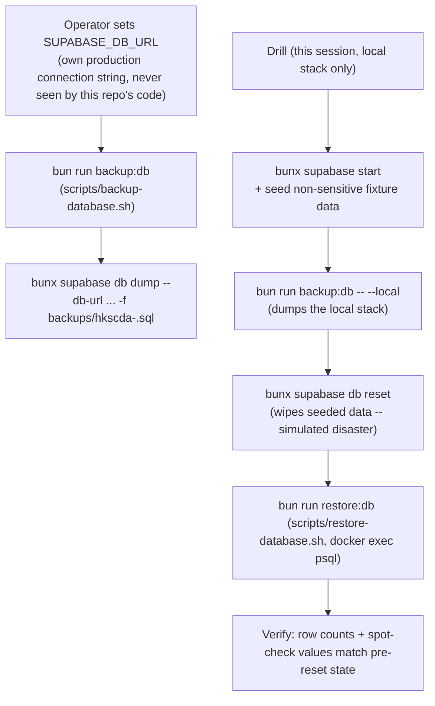

# Manual Backup/Restore Scripts and a Drilled Recovery Runbook (Phase 4)

**Date:** 2026-09-03
**Status:** Approved in conversation; awaiting written-spec review
**Master plan reference:** `docs/superpowers/plans/2026-08-27-public-layout-integration-v4.md`, Phase 4 ("backup drill")

## Summary

Adds two scripts (`backup-database`, `restore-database`) wrapping the Supabase CLI's own `db dump` command and a Postgres restore, plus a runbook documenting when and how to use them in a real emergency. This is one of seven independent items scoped under "Phase 4: Non-functional" in the master plan (RLS matrix, bilingual, a11y, and performance are done — [YNWAforever/hkscda#102](https://github.com/YNWAforever/hkscda/pull/102), PR #98, [YNWAforever/hkscda#103](https://github.com/YNWAforever/hkscda/pull/103), [YNWAforever/hkscda#104](https://github.com/YNWAforever/hkscda/pull/104); payment sandbox is explicitly deferred pending credentials; owner UAT is a separate, not-yet-started item).

## Current state

- This repo's Supabase project (ref `iihqjzilgawhfdhdevam`) is on the **free tier**, confirmed directly by the user — there is no built-in automatic backup or point-in-time recovery today. A donation platform handling real donor PII and payment records with zero backup safety net is a genuine operational risk, independent of anything about this codebase.
- The user explicitly chose, given this, to build a manual (not scheduled/automated) backup+restore capability now, rather than either building full automation or upgrading to a paid tier with built-in backups — both of which remain open options for later, not part of this work.
- No `pg_dump`/`psql` client binaries are installed on this machine (or assumed to be on any future contributor's machine) — confirmed by checking `PATH`. The Supabase CLI (already used throughout this session via `bunx supabase`, no separate install) bundles its own dump capability: `supabase db dump` — confirmed via `bunx supabase db dump --help` to support `--db-url` (dump from any Postgres connection string, percent-encoded), `--linked` (the project linked via `supabase link`), `--local` (the local CLI-managed stack), and `--dry-run` (prints the underlying `pg_dump` invocation without running it). This avoids requiring any new local tool install for anyone using these scripts.
- The Supabase CLI has no equivalent `db restore` subcommand — a dump produced by `supabase db dump` is a standard SQL file, and replaying it means piping it into `psql` against a target connection. Since `psql` isn't installed locally, the restore script targets Docker directly: `docker exec` into the target Postgres container's own `psql` (every Postgres Docker image, including the one the Supabase CLI's local stack uses, has `psql` built in) — this works for restoring into the local CLI-managed stack (this session's established, safe drill target) without requiring any new local dependency. Restoring into a real remote/production Postgres this way isn't possible (there's no local container to exec into) — that path uses the same dump file piped directly into a `psql`/`pg_restore` invocation the operator runs from wherever they do have Postgres client tools (their own machine, a bastion host, etc.); this script's job is to make the LOCAL drill possible without new installs, not to be the only way to ever restore.

## Approved decisions

- **Manual, on-demand scripts — not scheduled automation, not a paid-tier upgrade.** This closes the immediate "zero backup capability" gap with the least new infrastructure, while leaving the two more expensive options (a recurring automated job, or upgrading Supabase) as explicit, separate follow-ups the user can pursue later.
- **`scripts/backup-database.sh`** wraps `bunx supabase db dump --db-url "$SUPABASE_DB_URL" -f <timestamped-output-path>`. The connection string is read from an environment variable the operator sets themselves (`SUPABASE_DB_URL`) — this script never receives, logs, hardcodes, or otherwise handles the value; a fresh Claude Code session in this repo will never see a real production credential as a result of this work. Output goes to a new, gitignored `backups/` directory at the repo root, named with a timestamp (e.g. `backups/hkscda-2026-09-03T120000Z.sql`).
- **`scripts/restore-database.sh`** takes a dump file path and pipes its content into `docker exec -i <container> psql <connection-args>` against a **local** target only (the Supabase CLI's own local stack, `bunx supabase start`) — this is the session's drill target, not a path to restoring into production. The script explicitly refuses to run against anything that doesn't look like the local stack's own container (a guard, not a full production-safety mechanism — see "Error handling"), since accidentally replaying a dump into a live database would be destructive.
- **The drill performed in this session uses the local stack exclusively, never real production data or credentials**: seed a small amount of non-sensitive fixture data into a fresh local Supabase stack (via the existing `scripts/ci/supabase-fixture.mjs`-adjacent local-dev tooling, or a couple of direct inserts), take a real dump with `backup-database.sh --local`, deliberately destroy that data (`bunx supabase db reset`, which replays migrations from scratch and wipes all seeded rows — a controlled stand-in for "the data is gone" in a real disaster), restore the dump with `restore-database.sh`, and verify the previously-seeded data is back (row counts and a spot-check of actual values). This proves the backup→loss→restore cycle mechanically works without ever touching a real credential or real donor data.
- **`docs/backup-restore-runbook.md`** documents: prerequisites (Supabase CLI via `bunx`, Docker only needed for local drilling — not for taking a real production backup), the exact command to run a real backup (`SUPABASE_DB_URL=<your Supabase connection string> bun run backup:db`), where the dump lands and an explicit warning that a local `backups/` directory on one laptop is *not* itself durable disaster-recovery storage (the runbook recommends the operator move dump files to secure, off-machine storage — e.g. an encrypted cloud storage bucket — themselves; this repo's automation stops at producing the file), how to restore in a real emergency (piping a dump into `psql`/`pg_restore` against the real target, using this repo's local-drill script only as the pattern to follow, not as something that runs directly against production), and an explicit, honest statement of what this session's drill did and did not prove: it proved the dump-file format and restore mechanics work end-to-end against a real Postgres instance (the local CLI stack, which shares HKSCDA's actual schema and migrations); it did **not** prove a real production dump/restore round-trip, since that requires the operator's own production credentials and — given the risk of restoring test data over real donor records — should only ever be run by a human against a true throwaway target, never automated by an agent.

## Architecture

## File Structure

**Create:**
- `scripts/backup-database.sh` — wraps `supabase db dump`.
- `scripts/restore-database.sh` — wraps `docker exec ... psql` against the local stack only.
- `docs/backup-restore-runbook.md` — the operator-facing runbook.

**Modify:**
- `package.json` — add `backup:db` and `restore:db` scripts.
- `.gitignore` — add `backups/` (dump files must never be committed — they can contain real production data when used for real).

## Error handling

- `backup-database.sh` fails loudly (non-zero exit, the real `supabase db dump` error message) if `SUPABASE_DB_URL` is unset or the dump command itself fails — no silent partial-backup case.
- `restore-database.sh` refuses to run unless it can find a running Docker container whose name matches this project's local Supabase stack (`docker ps --filter name=supabase_db_hkscda`, or whatever the actual local container naming convention turns out to be at implementation time — confirm by inspecting `docker ps` output while the local stack is running, since Supabase CLI container names are derived from `project_id` in `supabase/config.toml`, already set to `"hkscda"` in this repo). No container matching → the script exits with an error rather than proceeding. This is a safety guard against fat-fingering a real target into a script whose entire job is "overwrite a database with the contents of a file," not a claim that it makes remote restores impossible by some other means — the script literally has no code path capable of reaching a non-local target at all.
- The runbook explicitly does not attempt to make a *real* production restore procedure "self-serve automated" — a human operator working from the documented `psql`/`pg_restore` pattern, using their own judgment and credentials, is the correct process for anything touching production, matching how the rest of this drill deliberately avoids ever handling real secrets.

## Testing

This spec's own deliverable is operational tooling, so "testing" means proving the tooling actually works:
- Run the full drill described above against the local Supabase CLI stack and confirm: the dump file is produced and is non-empty valid SQL; `db reset` genuinely removes the seeded data (confirmed via a query showing 0 rows before restore); the restore script successfully replays the dump; the previously-seeded data is verifiably back afterward (row counts and specific values match).
- Confirm `backup-database.sh` fails cleanly and with a clear error message when `SUPABASE_DB_URL` is unset, rather than hanging or producing a corrupt/empty dump file.
- Confirm `restore-database.sh` refuses to run against a target that doesn't pass its local-stack safety check.

## Out of scope

- Scheduled/automated backups (a recurring job) — an explicit, separate follow-up if the user later decides manual isn't sufficient.
- Upgrading the Supabase project to a paid tier with built-in point-in-time recovery — the user's own decision to make, not something this work assumes or blocks.
- An actual production dump/restore round-trip — deliberately left as a documented, human-run procedure in the runbook, not performed or automated by this session, given the real-data risk.
- Off-machine durable storage for backup files (e.g., automatically uploading dumps to cloud storage) — the runbook documents this as a manual operator responsibility for now; automating it is a reasonable future follow-up but adds a new credential/storage-destination surface this pass deliberately keeps out of scope.
- The other remaining Phase 4 item (owner UAT) — an independent follow-up. Payment sandbox remains explicitly deferred pending credentials.
