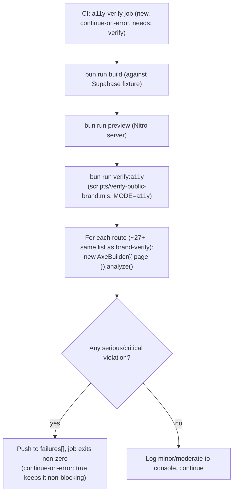

# Automated Accessibility (a11y) Verification for Public Routes (Phase 4)

**Date:** 2026-09-03
**Status:** Approved in conversation; awaiting written-spec review
**Master plan reference:** `docs/superpowers/plans/2026-08-27-public-layout-integration-v4.md`, Phase 4 ("a11y")

## Summary

Adds automated accessibility verification for every public route, using `@axe-core/playwright` run against a real, built preview of the app — the same infrastructure the existing `verify-public-brand.mjs`/`brand-verify` CI job already uses. This is one of seven independent items scoped under "Phase 4: Non-functional" in the master plan (the RLS matrix item is done, merged as [YNWAforever/hkscda#102](https://github.com/YNWAforever/hkscda/pull/102); bilingual is done via PR #98/decision D-14; payment sandbox is explicitly deferred pending credentials; performance, backup drill, and owner UAT are separate, not-yet-started items).

## Current state

- Zero accessibility tooling exists in this repo today: no axe, no Lighthouse CI, no `eslint-plugin-jsx-a11y` (confirmed by grepping `package.json` and `eslint.config.js`).
- `scripts/verify-public-brand.mjs` already exercises the exact infrastructure this work needs: it builds the app against a lightweight Supabase REST fixture (`scripts/ci/supabase-fixture.mjs`), starts the Nitro preview server, and drives Playwright (already a dependency, `^1.60.0`) across a route list (`staticRoutes`, dynamically-discovered `detailRoutes` for individual animal/sponsor/story pages, and synthetic `stateRoutes` for missing/expired states) — roughly 27+ routes total once dynamic routes resolve.
- The script already has a `mode` variable (`process.env.MODE ?? "brand"`) that gates brand-specific assertions (`if (mode === "brand") { await assertBrandLogo(...) }`) — this is an existing, unused extension point for additional check categories, not something this design introduces.
- The CI job (`brand-verify`) is a **required** branch-protection check (set up earlier this session). It is non-blocking-turned-required precedent: `continue-on-error: true` at first, promoted to required once green repeatedly — the same pattern already used for `rls-matrix` (still non-blocking) and now proposed for a11y.
- The original master plan's WP-1 done-criteria mentioned "Lighthouse a11y ≥ 95" and "axe no critical" as a narrower, 3-route sample (`/`, `/animals/cat`, `/adoption/apply`). This design supersedes that narrower check with full-route axe-core coverage; Lighthouse is deliberately not added (see Approved decisions).

## Approved decisions

- **axe-core only, not Lighthouse.** `@axe-core/playwright` gives specific, element-level WCAG rule violations, which are directly actionable for remediation. Lighthouse's accessibility score is largely powered by the same underlying axe rules internally, so adding it would mostly duplicate coverage with a less actionable score-based output, and its other categories (performance, SEO, best practices) overlap with the separate, not-yet-scoped "performance" Phase 4 item.
- **Extend the existing `verify-public-brand.mjs` script with a new `a11y` mode**, rather than writing a new, separate script. The route list, Playwright browser/context setup, fixture-backed build, and preview-server startup are already built and shared infrastructure; duplicating them in a second script would mean two places to keep in sync as routes change. A new `assertNoSeriousA11yViolations(page, label)` function runs whenever `mode === "a11y"`, alongside (not replacing) the route-iteration loop already in the script. Existing brand-only assertions (`assertBrandLogo`, etc.) stay gated to `mode === "brand"` and are unaffected.
- **New non-blocking CI job, `a11y-verify`**, mirroring `brand-verify`'s exact structure (checkout → setup-bun → build against fixture → install Chromium → start fixture + preview server → wait for readiness → run the verifier), but invoking a new `bun run verify:a11y` script (same underlying `scripts/verify-public-brand.mjs` file, just with `MODE=a11y` set) instead of `verify:brand`. `needs: verify`, `continue-on-error: true` — matching the established non-blocking-first precedent (`brand-verify` was promoted to required after being green 5+ times; `rls-matrix` remains non-blocking pending the same). Promoting `a11y-verify` to required is an explicit, separate follow-up, not part of this work.
- **Severity gate: fail only on `serious`/`critical` axe violations.** axe-core's `impact` field has four levels (`minor`, `moderate`, `serious`, `critical`). The CI job's exit code reflects only `serious`/`critical` findings (matching the existing `failures` array/exit-code mechanism already in the script). `minor`/`moderate` violations are printed to the job's console output for visibility (so they aren't invisible to future work) but never fail the build — this repo has never had any a11y tooling before, so a first real scan across 27+ pages surfacing many low-severity findings is expected, and gating on everything from day one would make an already-non-blocking job noisy without adding remediation value in this pass.
- **Checked once per route, at a single desktop viewport (1440×900)** — not across all 5 viewports `verify-public-brand.mjs` already uses for reflow/screenshot checks. axe-core's DOM/ARIA-structure rules do not meaningfully vary by viewport size (the main exception, touch-target sizing, is itself a `minor`/`moderate`-impact rule in axe-core's own severity mapping, which this pass doesn't gate on). Running once per route keeps the new job's runtime close to `brand-verify`'s own, rather than 5x-ing axe's per-page analysis cost for no gain at the severity level this pass cares about.
- **Remediation scope for this pass: fix whatever `serious`/`critical` violations the real, live first scan actually finds** (the axe-core check runs against the live app during plan-writing, before any concrete remediation tasks are written — mirroring how the RLS behavioral matrix plan was written only after empirically reading the actual current policies, not assumed ones). `minor`/`moderate` findings from that same first scan are written into this spec as an explicit, itemized follow-up list (not fixed as part of this work) once they're known.

## Architecture

## Test harness structure

**Modified file: `scripts/verify-public-brand.mjs`**
- New dependency: `@axe-core/playwright` (devDependency), imported as `AxeBuilder`.
- New function `assertNoSeriousA11yViolations(page, label)`, called from the existing route-iteration loop (the same `for (const route of routes)` loop already there) whenever `mode === "a11y"` — mirroring how `assertBrandLogo` is called only when `mode === "brand"`.
- Runs `await new AxeBuilder({ page }).analyze()`, partitions `results.violations` by `impact` (`serious`/`critical` → `recordFailure(...)`; `minor`/`moderate` → a separate console-logged list, not pushed to `failures`).
- Reuses the existing route list, browser/context setup, and the single desktop-sized (1440×900) viewport already in `viewports` — the a11y check runs only against that one viewport entry when `mode === "a11y"` (skip the other 4 viewport iterations for this mode, since they exist for brand's reflow/screenshot checks, not for a11y).

**New script in `package.json`:** `"verify:a11y": "node scripts/verify-public-brand.mjs"` (same command as `verify:brand`; the CI job differentiates behavior via the `MODE` env var, matching how `verify:brand`'s own CI invocation already sets `MODE: brand`).

**New CI job in `.github/workflows/ci.yml`:** `a11y-verify`, structurally identical to `brand-verify` (same fixture/build/preview-server steps), but running `bun run verify:a11y` with `MODE: a11y` instead of `bun run verify:brand` with `MODE: brand`.

## Error handling

- A route that fails to load (non-2xx response, network error) is already recorded as a failure by the existing `gotoRoute`/error-handling logic in the script — the a11y check doesn't need to duplicate this, it only runs `analyze()` on routes that already loaded successfully.
- If `AxeBuilder.analyze()` itself throws (e.g., a page that never settles), that's caught by the same try/catch already wrapping each route's checks in the existing loop, and recorded as a route failure — consistent with how brand-mode failures are already handled.

## Testing

This spec's own deliverable is a verification tool, so "testing" means confirming the tool itself is trustworthy:
- Manually verify `bun run verify:a11y` actually runs against a local preview build and produces `serious`/`critical` failures for at least one deliberately-known-bad case, and passes cleanly once real findings are fixed.
- Manually verify `bun run verify:brand` (existing brand mode) is completely unaffected — same routes, same assertions, same pass/fail outcome as before this change.
- CI run: confirm the new `a11y-verify` job actually starts the fixture + preview server and runs axe-core successfully in GitHub Actions' `ubuntu-latest` runner, before considering this shippable (even though the job itself is non-blocking).

## Known findings from the first real scan

Scanned against a real preview build (fixture-backed Supabase, matching `brand-verify`'s exact setup — plain `bun run dev` with no backend was tried first but is inadequate: `/help` and `/about` 500 and `/animals/cat` redirects empty without a real Supabase config reachable at request time, not just build time). All 26 routes from `verify-public-brand.mjs`'s existing route list (`staticRoutes` + 4 discovered `detailRoutes` + 4 synthetic `stateRoutes`) scanned successfully; none skipped. 17/26 routes had zero violations of any severity.

**Serious/critical (1 unique finding — fixed by this plan):**

- **`definition-list`**, impact `serious`, on `/about` only. `src/routes/about/index.tsx` (~line 160-172): the impact-stats `<dl>` wraps each stat in a `
` containing `<dt>`, `<dd>`, **and** a sibling `
資料截至 {item.asOf}
` caption — axe's `definition-list` rule requires each such wrapper to contain *only* the dt/dd pair. Independently confirmed by reading the file directly. No `critical`-impact findings anywhere.

**Minor/moderate (2 unique findings — logged here as follow-up, not fixed in this pass):**

1. **`region`**, impact `moderate`, "All page content should be contained by landmarks" — 6/26 routes (`/adoption/apply`, `/sponsors/pledge`, `/volunteer`, and the three synthetic `.../status/__brand-verification__` state routes), 8 affected-node instances. Root cause: `src/components/site/PublicFormFrame.tsx`'s `.trust-cue` paragraph and `.detail-breadcrumb` chrome render outside `<main>` — this is **documented as deliberate** in the component's own comment ("Deliberately does not own a `<main>` or a heading: every page it wraps already has its own `<main>` and `<h1>` ... a frame that supplied a second copy of either would produce a duplicate `<main>` landmark or a duplicate `<h1>`"), independently confirmed by reading the file. Worth weighing as an intentional tradeoff if ever revisited, not a blind oversight to "just fix."
2. **`landmark-one-main`**, impact `moderate`, "Document should have one main landmark" — 2/26 routes: `/stories/__brand-verification__` and `/__brand-verification-missing__`, the site's synthetic story-not-found and missing-route recovery states. Real users reach equivalent states too (e.g., an invalid `/stories/<id>`), so this isn't a purely synthetic-route artifact, but it's still moderate-impact and out of scope for this pass per the Approved decisions above.

## Out of scope

- Lighthouse-based accessibility scoring — axe-core only, per the Approved decisions above.
- Promoting `a11y-verify` to a required branch-protection check — follow-up once proven green repeatedly, matching the `brand-verify`/`rls-matrix` precedent.
- Fixing `minor`/`moderate` axe findings — logged as follow-up in this spec once known, not fixed in this pass.
- Manual accessibility audit work beyond what axe-core's automated ruleset covers (axe-core catches roughly 30-50% of WCAG issues by its own documentation; a full manual audit — screen reader testing, keyboard-only walkthroughs beyond what `verify-public-brand.mjs` already checks for the header, cognitive-load review — is a separate, not-yet-scoped effort).
- The other six Phase 4 items (payment sandbox, performance, backup drill, owner UAT — RLS matrix and bilingual are already done).
