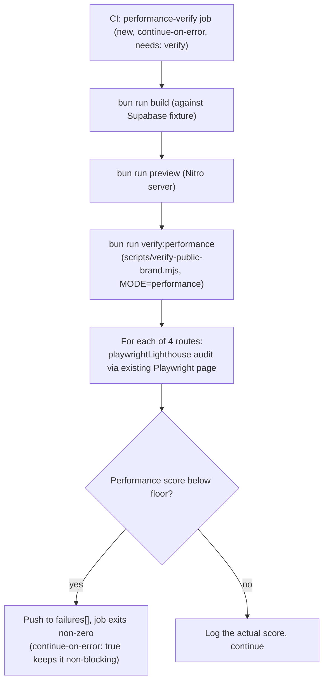

# Automated Performance Verification for Public Routes (Phase 4)

**Date:** 2026-09-03
**Status:** Approved in conversation; awaiting written-spec review
**Master plan reference:** `docs/superpowers/plans/2026-08-27-public-layout-integration-v4.md`, Phase 4 ("performance")

## Summary

Adds automated Lighthouse performance verification for a small, representative sample of public routes, run via `playwright-lighthouse` inside the same fixture-backed preview build and Playwright infrastructure the existing `verify-public-brand.mjs` script already uses for brand and a11y checks. This is one of seven independent items scoped under "Phase 4: Non-functional" in the master plan (RLS matrix, bilingual, and a11y are done — [YNWAforever/hkscda#102](https://github.com/YNWAforever/hkscda/pull/102), PR #98, [YNWAforever/hkscda#103](https://github.com/YNWAforever/hkscda/pull/103); payment sandbox is explicitly deferred pending credentials; backup drill and owner UAT are separate, not-yet-started items).

## Current state

- Zero performance tooling exists in this repo today: no Lighthouse CI, no bundle analyzer, no web-vitals tracking (confirmed by grepping `package.json`).
- `vite.config.ts` is minimal — almost all build behavior comes from a shared preset (`@lovable.dev/vite-tanstack-config`), so there is little existing build configuration to build on or be constrained by.
- `scripts/verify-public-brand.mjs` already has the exact infrastructure this work needs: a fixture-backed build (`scripts/ci/supabase-fixture.mjs`), a Nitro preview server, and Playwright driving a route list — and already has two prior extensions (`brand`, `a11y`) via its `mode` variable, an established pattern for adding a new check category without duplicating the build/fixture/preview scaffolding.
- The original master plan's WP-1 done-criteria named a 3-route Lighthouse sample (`/`, `/animals/cat`, `/adoption/apply`) for an a11y-score check — a11y ended up using axe-core across all routes instead (see the a11y design spec's "Approved decisions"), leaving that original Lighthouse-based route sample unused. This design reuses that same 3-route set for the performance score check it was originally intended for, plus `/donate` (the core conversion page for a donation-funded nonprofit).
- Lighthouse's composite performance score is well-documented as noisy in shared/virtualized CI environments — the same page can score meaningfully differently between runs due to inconsistent CPU throttling calibration on shared runners, unlike axe-core's deterministic DOM-rule violations. This is a real constraint on how tightly any CI gate here can reasonably be set, independent of anything about this specific codebase.

## Approved decisions

- **`playwright-lighthouse`, not the standalone `lighthouse` CLI or `@lhci/cli`.** It runs a Lighthouse audit directly inside an existing Playwright `page`/browser context, so it reuses the exact same fixture-backed build, preview server, and browser launch this script already has for `brand`/`a11y` modes — no second Chrome instance, no separate CI infrastructure to stand up and keep in sync.
- **Extend the existing `verify-public-brand.mjs` script with a third mode, `performance`**, following the same pattern `a11y` used: a new assertion function called from the existing per-route loop, gated on `mode === "performance"`, running only at the single desktop viewport (matching `a11y` mode's existing viewport-skip approach) and skipping the reflow/reduced-motion checks that are brand-specific.
- **Small representative sample: `/`, `/animals/cat`, `/adoption/apply`, `/donate`** (4 routes) — not the full 26+-route list `brand`/`a11y` modes use. Lighthouse audits are far heavier per-page than axe-core's DOM analysis (each involves multiple simulated page loads under throttling), so a full-route sweep would make CI duration much longer and multiply the CI-noise surface for comparatively little benefit — the goal is catching regressions on the highest-traffic, highest-stakes pages, not exhaustively auditing every synthetic state route.
- **New non-blocking CI job, `performance-verify`**, mirroring `a11y-verify`'s exact structure (checkout → setup-bun → build against fixture → install Chromium → start fixture + preview server → wait for readiness → run the verifier), invoking a new `bun run verify:performance` script. `needs: verify`, `continue-on-error: true` — matching the established non-blocking-first precedent used for every prior Phase 4 CI addition this cycle (`rls-matrix`, `a11y-verify`). Promoting `performance-verify` to required is an explicit, separate follow-up, not part of this work.
- **Performance-score floor set from a real baseline scan, deliberately conservative given CI noise** — rather than assume a target number, the actual score for each of the 4 routes will be measured against the live app during plan-writing (mirroring the RLS/a11y precedent of investigating real state before writing plan content), and the floor set low enough to catch genuine regressions without generating false-positive noise from normal CI-environment score variance. See "Known baseline" below, filled in once measured.
- **Checked once per route** (no viewport/throttling-profile matrix) — Lighthouse's own simulated-throttling model already approximates a mobile network/CPU profile by default; running multiple additional configurations per route would multiply CI duration and noise surface for a check that's explicitly scoped as a coarse regression floor, not a detailed performance audit.

## Architecture

## Test harness structure

**Modified file: `scripts/verify-public-brand.mjs`**
- New dependency: `playwright-lighthouse` (devDependency).
- A new, small route list constant (e.g. `performanceRoutes = ["/", "/animals/cat", "/adoption/apply", "/donate"]`), separate from the existing `staticRoutes`/`detailRoutes`/`stateRoutes` used by `brand`/`a11y` modes — `performance` mode iterates this smaller list instead of the full `routes` array the other two modes use.
- A new function (name TBD at plan-writing time, following this file's existing `assert*` naming convention) that runs a `playwrightLighthouse` audit against the current page and records a failure if the performance category score falls below the floor.
- Gated the same way `a11y` mode is: skipped for the 4 non-desktop viewports, and skips the brand-specific reflow/reduced-motion checks.

**New script in `package.json`:** `"verify:performance": "MODE=performance node scripts/verify-public-brand.mjs"` (matching `verify:a11y`'s corrected pattern of setting `MODE` inline in the script command itself, not relying on a CI-only env var).

**New CI job in `.github/workflows/ci.yml`:** `performance-verify`, structurally identical to `a11y-verify` (including its artifact-upload-on-failure step), but running `bun run verify:performance` with `OUTPUT_DIR: artifacts/performance-ci`.

## Error handling

- A route that fails to load is already recorded as a failure by the existing `gotoRoute`/error-handling logic — the performance check only runs `playwrightLighthouse` on routes that already loaded successfully, consistent with how `a11y` mode's `assertNoSeriousA11yViolations` is structured.
- If the Lighthouse audit itself throws (e.g., a page that never reaches a stable network-idle state within Lighthouse's own timeout), that's caught by the same try/catch already wrapping each route's checks in the existing loop.

## Testing

This spec's own deliverable is a verification tool, so "testing" means confirming the tool itself is trustworthy:
- Manually verify `bun run verify:performance` actually runs a real Lighthouse audit against a local preview build for all 4 routes and produces a real score, not a stub/mocked value.
- Manually verify `bun run verify:brand` and `bun run verify:a11y` are both completely unaffected — same routes, same assertions, same pass/fail outcome as before this change.
- CI run: confirm the new `performance-verify` job actually starts the fixture + preview server and runs a real Lighthouse audit successfully in GitHub Actions' `ubuntu-latest` runner, before considering this shippable (even though the job itself is non-blocking).

## Known baseline (filled in during plan-writing)

*To be filled in once `playwright-lighthouse` is actually run against the live app for the 4 target routes, before the implementation plan's concrete floor value and any remediation tasks are written — matching this session's established practice of investigating real state before writing plan content rather than assuming it. This section will list each route's actual measured performance score, and either confirm no remediation is needed (floor set comfortably below the real scores) or list specific, real performance issues Lighthouse's audit details surface (e.g., unoptimized images, render-blocking resources, oversized JS bundles) if any route scores low enough to warrant fixing as part of this work.*

## Out of scope

- Bundle-size budgets, image-optimization pipelines, or other deep performance engineering beyond what a baseline Lighthouse floor check and its surfaced audit details call for — this spec's scope is a regression-catching CI gate plus fixing whatever the first real scan finds, not a comprehensive performance re-architecture.
- Promoting `performance-verify` to a required branch-protection check — follow-up once proven green (i.e., not flaky) repeatedly, matching the `brand-verify`/`rls-matrix`/`a11y-verify` precedent.
- Full-route Lighthouse coverage (all 26+ public routes) — an explicit, separate follow-up if the 4-route sample proves valuable and CI duration/noise allows expanding it later.
- The other remaining Phase 4 items (backup drill, owner UAT) — each is an independent follow-up. Payment sandbox remains explicitly deferred pending credentials.
